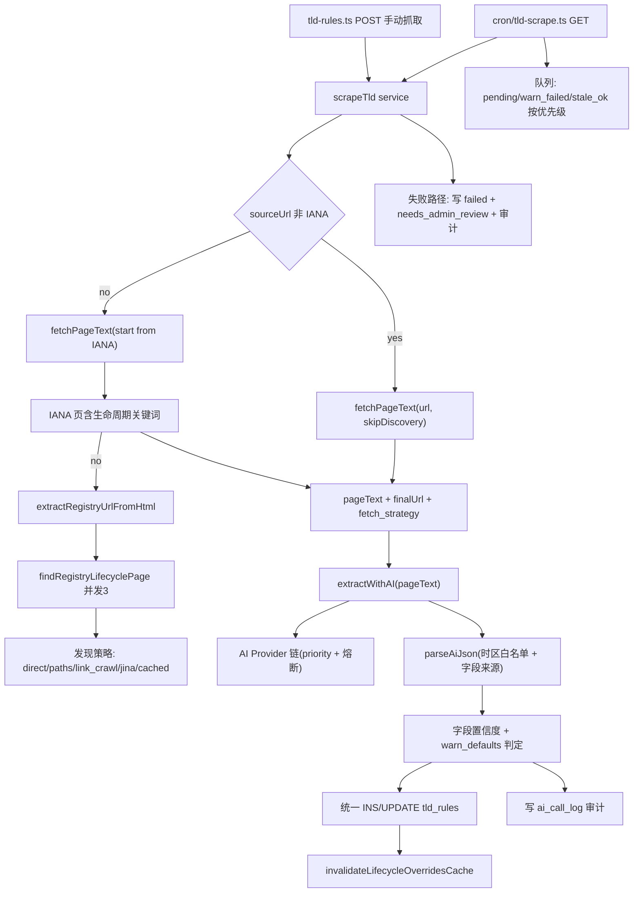
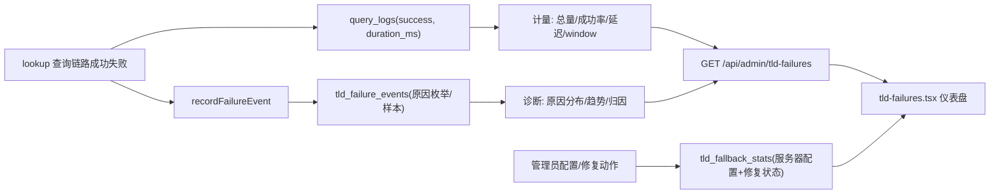

# Design — TLD 生命周期 AI 抓取与查询失败统计升级

Feature Name: tld-lifecycle-crawl-failstats-upgrade
Updated: 2026-09-06

## Description

对后台两套子系统升级：

- **TLD 生命周期 AI 抓取**：将手动抓取（`tld-rules.ts` POST）与 cron 批量抓取（`cron/tld-scrape.ts`）收敛为统一 `scrapeTld` 服务，叠加 Provider 熔断降权、AI 字段来源置信度、时区白名单校验、动态 IANA 计数、用量审计、并行发现与 TTL 刷新。
- **后缀查询失败统计**：事实源重构为「query_logs 计量 + 新表 tld_failure_events 诊断」，`tld_fallback_stats` 专管服务器配置；新增窗口统计仪表盘修复周对比恒 0 的缺陷。

两个模块独立演进，不改变既有对外查询链路。生命周期数据通过既有 `lifecycle-overrides.ts` 双层缓存（AI 抓取值 + 手工覆盖）继续对 /dashboard 生效。

## Architecture

### 1. 抓取管线（统一服务层）



### 2. 失败统计双事实源



## Components and Interfaces

### 新建 `src/lib/server/tld-scrape.ts` — 统一抓取服务

```ts
export interface ScrapeOptions {
  tld: string;
  sourceUrl?: string;   // 显式 URL 时跳过 IANA 发现
  force?: boolean;      // true 时跳过 skip 检查
  model?: string;       // preferredProviderId
}
export interface ScrapeOutcome {
  tld: string;
  ok: boolean;
  status: "ok" | "warn_defaults" | "failed";
  extracted?: ParsedLifecycle;         // 含 fields_source 标记
  fetchStrategy?: string;
  sourceUrl?: string;
  modelUsed?: string;
  error?: string;
}
export async function scrapeTld(opts: ScrapeOptions): Promise<ScrapeOutcome>;
```

职责：skip 检查（`manually_edited` 保护 / `ok` 未超 TTL / `force` 绕过）→ 限流 → 抓取与发现 → AI 提取 → 统一写入 `tld_rules` → 失效生命周期缓存 → 审计落库。cron 与 POST 均只调用此函数。

### 改造 `tld-rules.ts`

- `fetchPageText` 返回 `{ text, finalUrl, fetchStrategy }`，在发现命中处记录 `direct | registry_paths | link_crawl | jina | registry_cached | iana_direct`。
- `findRegistryLifecyclePage`（tld-rules.ts:364）内部候选链接改用并发 3 的限流队列；Jina 连续失败 2 次短路该 TLD 的剩余 Jina 策略。
- POST（tld-rules.ts:718）异常分支补写 `tld_rules.failed` 记录，替代当前仅回 500（tld-rules.ts:895-899）。
- 统计块（tld-rules.ts:700-712）的 `IANA_TOTAL` 改为动态根区计数（R9）。

### 改造 `ai-providers.ts`

- 新增进程内 `breaker`（滑窗 5 分钟连续失败 3 次 → open 10 分钟 → 半开放行 1 次）与 `providerStats` 计数器。
- `callProviderWithFallback`（ai-providers.ts:331）遍历时先查熔断器；全部熔断时立即抛熔断汇总。
- 每次调用（成功/失败/耗时/错误）经异步队列写入 `ai_call_log`，不阻塞返回。

### 改造 `db.ts` 失败记录

- `recordTldLookupFailure`（db.ts:894）改为不再累加 `tld_fallback_stats.fail_count`，改调 `recordFailureEvent({ tld, reason, domain, errorMsg, context })` 写 `tld_failure_events`，原因归类函数 `classifyFailure` 输出扩展枚举（R3）。
- 保留 `setTldApiSource / clearTldFailureStats / recordTldRepair` 等配置写入维持 `tld_fallback_stats` 语义（R5）。
- `tld_fallback_stats` 增加 `ADD COLUMN IF NOT EXISTS fail_reason_detail TEXT`（原始错误，事件表截断 300 后这里可存汇总）。

### 改造 `tld-failures.ts` + `tld-failures.tsx`（R4 仪表盘）

- GET 增加 `window` 参数（7/30 天），返回：
  - `metrics`: 窗口内失败/成功/成功率/上一窗口失败/增量百分比（聚合 query_logs）
  - `reason_dist`: 各枚举计数（聚事件表）
  - `trend`: 按日失败计数数组（聚事件表）
  - `top_failed`: 按窗口失败数降序（健康度 + 成功率 + 最近样本）
  - 既有分页列表增加成功率列（同窗口 query_logs 聚合）
- 列表「本周/上周」对比列改从 query_logs/事件表按窗口聚合（修复 B1）。
- 前端图表用纯 DOM/CSS（条形/迷你折线），不引入 recharts 等新依赖。

### 新建 `src/pages/api/admin/ai-stats.ts` + 后台用量区块

- `GET /api/admin/ai-stats`: 聚合 `ai_call_log` 返回各 Provider 成功/失败/avg_ms/最近错误 + 熔断状态。
- 挂入 `tld-rules.tsx` 的相关 Tab（或独立 `/admin/ai-stats` 页）。

### cron 队列扩展（`cron/tld-scrape.ts`, R13）

- `getNextBatch` 队列优先级扩展为：pending → warn_defaults/failed（未达上限）→ `stale_ok`（`scrape_status='ok'` 且 `scraped_at < NOW() - INTERVAL '180 days'`）。
- 每批内仍串行处理单个 TLD（控制 Vercel 函数时长），发现阶段内部按 R12 并发。
- 批量刷新入口：`PATCH /api/admin/tld-rules { action:'reset-ok', tlds:[...] }`（跳过 `manually_edited`），页面复用现有 BatchPanel 多选。

## Data Models

### 新表 `tld_failure_events`

```sql
CREATE TABLE IF NOT EXISTS tld_failure_events (
  id          BIGSERIAL PRIMARY KEY,
  tld         TEXT         NOT NULL,
  fail_reason TEXT         NOT NULL,   -- 扩展枚举（R3）
  reason_detail TEXT,                  -- 原始错误摘要（300 字符）
  domain      TEXT,                    -- 查询域名
  context     TEXT,                    -- lookup / whois / rdap / api
  created_at  TIMESTAMPTZ  NOT NULL DEFAULT NOW()
);
CREATE INDEX IF NOT EXISTS idx_fev_tld_created ON tld_failure_events (tld, created_at DESC);
CREATE INDEX IF NOT EXISTS idx_fev_created     ON tld_failure_events (created_at DESC);
CREATE INDEX IF NOT EXISTS idx_fev_reason      ON tld_failure_events (fail_reason);
```

### 新表 `ai_call_log`

```sql
CREATE TABLE IF NOT EXISTS ai_call_log (
  id         BIGSERIAL PRIMARY KEY,
  provider   TEXT   NOT NULL,   -- provider.id（如 glm4flashx / gemini20flash）
  model      TEXT   NOT NULL,
  kind       TEXT   NOT NULL,   -- tld_lifecycle / find_server 等
  tld        TEXT,
  ok         BOOLEAN NOT NULL,
  ms         INTEGER,
  error      TEXT,              -- 失败时错误前 200 字符
  created_at TIMESTAMPTZ NOT NULL DEFAULT NOW()
);
CREATE INDEX IF NOT EXISTS idx_acl_created ON ai_call_log (created_at DESC);
```

### `tld_rules` 新增列

```sql
ALTER TABLE tld_rules ADD COLUMN IF NOT EXISTS fields_source JSONB;   -- 字段来源标记（R7）
ALTER TABLE tld_rules ADD COLUMN IF NOT EXISTS fetch_strategy TEXT;    -- 发现策略（R6, 修复现有定义未赋值缺陷）
ALTER TABLE tld_rules ADD COLUMN IF NOT EXISTS raw_excerpt TEXT;       -- cron 路径补齐（R6）
```

- `confidence` 语义：沿用 `est/high`，同时由 `fields_source` 推导抓取置信度展示。
- 旧 AI 输出格式（纯数值）兼容：`parseAiJson` 同时接受「数值直出」与「`{value,source,quote}` 嵌套」两种结构，无来源时默认 `industry_default` 且标注 very_low。

### `tld_fallback_stats` 职责收窄

- 保留列：`whoiser_bypass / tld_api_source / repair_status / found_server / admin_notes / repaired_at`。
- `fail_count / fail_reason / last_domain / sample_error` 不再由查询链路累加；已有历史行由数据迁移清零一次（避免陈旧计数干扰新视图）。

## Correctness Properties

1. **统计事实源唯一**：窗口计数、成功率、趋势一律来自 `query_logs`（`success` 列）；失败事件只做诊断明细，两者不得互相覆盖写入。
2. **查询主路径零阻塞**：`recordFailureEvent` 与 `ai_call_log` 写入均为 fire-and-forget，异常只记日志；Vercel 函数冻结造成的小比例丢事件属于已知边界。
3. **赃值不落库**：`drop_timezone` 非白名单即 null；drop 三件套无 `page_explicit` 来源即整体置 null。
4. **队列单调性**：`manually_edited` 永不进入自动队列；`ok` 未超 TTL 不重抓（force 或手动批量除外）；`no_data` 仅可通过管理员重置回 pending。
5. **熔断单调**：breaker 状态为进程内单例，open 期间回退跳过该 Provider；并发调用共享同一状态，不做跨实例同步。
6. **一致性**：抓取成功后立即 `invalidateLifecycleOverridesCache()` 使 /dashboard 生命周期展示与 `tld_rules` 一致。

## Error Handling

| 场景 | 处理 |
|---|---|
| AI 全部 Provider 失败/被熔断 | `scrapeTld` 将 `tld_rules` 置 `failed` + `needs_admin_review`，reason = 熔断/错误汇总；POST 返回 502，cron 记 `failed` 并计数尝试 |
| 发现阶段 Jina 连续失败 | 本 TLD 跳过剩余 Jina 策略，走缓存/回退默认，不回写失败 |
| IANA 根区计数获取失败 | 回退缓存值，接口标注 `ianasource_stale=true` |
| 事件表/审计写入失败 | 忽略并记录 warn，不影响查询与抓取结果 |
| 首次接入后旧 AI 返回非 JSON | `parseAiJson` 兜底解析 + 置信度 very_low；仍无法解析则视为失败落库 |
| rate limit(1/小时/TLD, force 不豁免) | 返回既有 429，普通手动重复抓取继续受限 |

## Test Strategy

1. **vitest 单元测试**（沿用 lifecycle.test.ts 方式）：
   - `parseAiJson`：新嵌套格式 / 旧直出格式 / 夹杂文本 / 非法 JSON
   - 时区白名单：`Europe/Berlin`、`Asia/Shanghai`、`UTC` 通过；`GMT+2`、`Berlin`、垃圾值置 null
   - `warn_defaults` 判定：全 `industry_default` → 需复核；有任一 `page_explicit` → 保留
   - 熔断器：连续失败开门 / 冷却期半开 / 成功关门
   - `classifyFailure`：ETIMEDOUT→connect_timeout、Cloudflare→http_blocked、404→http_not_found、空体→empty_response
2. **集成验证**（同既有验证链）：`npx tsc --noEmit` → dev SSR（port 3777）→ `next build`（PWA 产物 .gitignore）→ 生产部署 → 线上 `--resolve` curl。
3. **手工冒烟**：
   - `POST /api/admin/tld-rules`（一个已知 ccTLD）→ 返回含 `fetch_strategy`、`fields_source`、`model_used`
   - `GET /api/admin/tld-failures?window=7` → `metrics`/`reason_dist`/`trend`/`top_failed` 齐全且 `this_week_count` 不为常 0
   - `GET /api/admin/ai-stats` → 显示调用统计与熔断状态
4. **回归**：/dashboard 生命周期展示、既有 /admin/tld-rules 列表与导出不受影响。

## References

[^1]: src/lib/server/ai-providers.ts — Provider 定义与 `callProviderWithFallback`（L331-359）、多模型 priority
[^2]: src/pages/api/admin/tld-rules.ts — POST 单抓（L718-900）、fetchPageText 与 IANA 发现（L466-545）、findRegistryLifecyclePage 四策略（L357-464）、AI 提炼（L561-634）、写死 IANA_TOTAL（L700-712）
[^3]: src/pages/api/cron/tld-scrape.ts — 批量队列、saveTldRule/saveFailure/markNoData 重复实现（L45-158）
[^4]: src/lib/db.ts — `recordTldLookupFailure`（L894-928）、tld_api_source 配置读写（L810-888）、tld_fallback_stats 建表（L116-126）
[^5]: src/pages/api/admin/tld-failures.ts — GET 列表与失效的周对比 JOIN `search_history`（L106-125）
[^6]: src/pages/api/admin/tld-speed-stats.ts — query_logs 聚合范式（成功率/百分位延迟，L44-76）
[^7]: src/lib/server/lifecycle-overrides.ts — tld_rules + tld_lifecycle_overrides 双层缓存（L26-107）与失效（L109-118）
[^8]: `.monkeycode/MEMORY.md` — search_history 仅记成功查询；Vercel lambda fire-and-forget 丢事件边界；验证链惯例