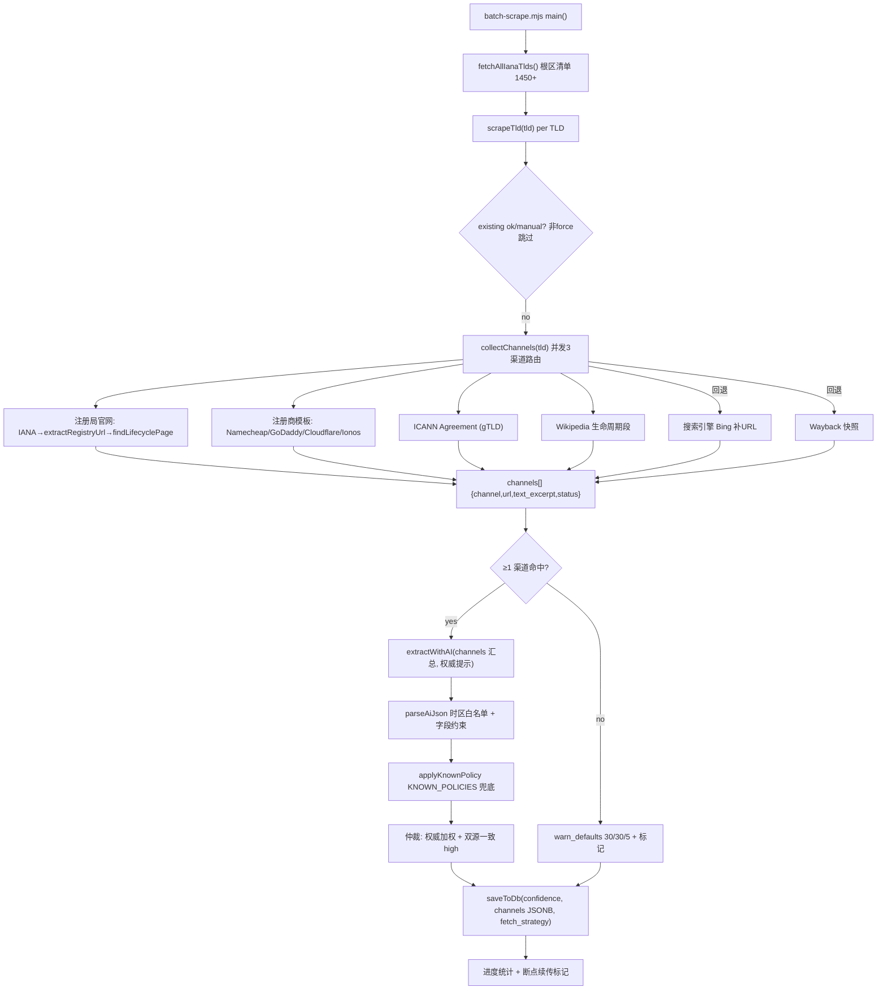

# Design — TLD 生命周期多渠道全量抓取

Feature Name: tld-multichannel-fullcrawl
Updated: 2026-09-06

## Description

将 `scripts/batch-scrape.mjs` 从「单渠道（IANA→注册局官网→单一 AI）补 90 条」升级为「IANA 根区全量 TLD 清单 + 多渠道路由 + AI 权威加权综合裁决」。

**关键改进**：
- 清单：以 IANA 根区文件（约 1450+ 非 IDN）为唯一事实源，缺口自动种子入库，当前 237 条 → 全量。
- 路由：每个 TLD 采集注册局官网（既有发现链）、注册商政策页（Namecheap/GoDaddy/Cloudflare/Ionos 模板）、ICANN Registry Agreement（gTLD）、Wikipedia 生命周期段、搜索引擎（Bing 优先）补 URL、Wayback 快照回退。
- 裁决：全部渠道原文进单次 AI 综合裁决，按权威优先级 `registry > registrar > icann > wiki > search > wayback > iana` 加权，字段级标注来源渠道。
- 落库：新增 `channels JSONB` 存渠道快照；既有 `source_url/confidence/ai_reasoning/fetch_strategy` 升级承载渠道引用。
- 执行：后台直接全量跑，`--concurrency` + 断点续传 + SIGTERM/SIGINT 优雅结束。

## Architecture



## Components and Interfaces

### 改造 `scripts/batch-scrape.mjs`

核心重构点是抓取链路由 `fetchPageText(tld, ianaUrl)` 单返回升级为 `collectChannels(tld, ianaUrl)` 多返回。

### `collectChannels(tld, ianaUrl): Promise<ChannelResult[]>`

```js
/**
 * 多渠道路由，聚合各渠道原文。
 * ChannelResult = { channel, url, text_excerpt, status: 'ok'|'empty'|'error' }
 * channel ∈ registry | registrar | icann | wiki | search | wayback | iana
 */
```

实现要点：
1. **注册局官网**：复用既有 `fetchRaw → extractRegistryUrl → findLifecyclePage`，原样保留作为第一高权威渠道；`finalUrl` 即注册局生命周期页 URL；strategy 映射到 `fetch_strategy`。
2. **注册商模板**：`REGISTRAR_TEMPLATES` 常量字典，按 TLD 动态构造 URL：
   - Namecheap: `https://www.namecheap.com/domains/registration/gtld/${tld}/`
   - GoDaddy: `https://www.godaddy.com/en-ie/tlds/${tld}-domain`
   - Cloudflare: `https://www.cloudflare.com/tld-policy/`
   - Ionos: `https://www.ionos.com/domains/domain-offers/${tld}-domain`
   逐家抓取，带 403/429 识别与每域独立降频（`hostRateLimit` map），全部失败不阻塞。
3. **ICANN Agreement**：仅 gTLD（`tld.length>2`），命中 `*IANA 归属 gTLD*` 后从 `https://www.icann.org/resources/pages/registry-agreements-2012-02-25-en` 聚合页或 Registry Agreement URL 规则提取；条款给定的是 Delete Grace（5d 默认），作为 `redemption=0?` 参考低优先级渠道（`icann` 权威低于 registrar 由 AI 处理）。
4. **Wikipedia**：`https://en.wikipedia.org/wiki/.${tld}` 生命周期段，`fetch_raw` + 提取"Expiry / deletion / quarantine"表格行。
5. **搜索引擎**（回退链 A）：Bing `https://www.bing.com/search?q=${tld}+domain+grace+period+redemption`，`fetch_raw` 提取结果正文前 N 字符；Bing 失败回退 Google（仅条件调用）。
6. **Wayback**（回退链 B）：`https://web.archive.org/web/${ms}/${registryUrl}`，当注册局官网直抓失败时回退快照。

### `collectChannels` 的调用策略

- 主渠道（registry/registrar/icann/wiki）并发 3（`Promise.allSettled`），各自独立超时（`fetchRaw` 默认 15s，注册商模板 8s）。
- 只有所有主渠道均未命中时才走 search/wayback 回退（避免每 TLD 都打搜索接口，控制外呼频率）。
- 每 TLD 总渠道文本预算：各渠道 `text_excerpt` ≤ 1200 字符汇入 AI，超预算优先裁掉 wayback/search 回声。

### `extractWithAI` 升级（多渠道裁决）

签名扩展为 `extractWithAI(tld, channelResults, sourceUrl)`：

1. 构造 `userMsg`：
   ```
   TLD: .${tld}  [类型提示]
   [权威优先级提示] registry官网 > 注册商政策页 > ICANN协议 > Wikipedia > 搜索结果 > 存档回退 > IANA页
   平台规范: 若某渠道页面明确给出宽限/赎回/待删天数请采纳并注明；多源冲突时以高权威渠道为准。
   渠道原文(按权威降序):
   [registry] https://www.denic.de/... 
   <text>
   [registrar] https://www.namecheap.com/... 
   <text>
   ...
   ```
2. `SYSTEM_PROMPT` 新增输出约束：每个数值字段需附 `来源标志`（channel 名 + 是否 `page_explicit`），AI 返回格式：

   ```json
   {
     "grace_period_days": 0,
     "redemption_period_days": 30,
     "pending_delete_days": 5,
     "drop_hour": 11,
     "drop_minute": 0,
     "drop_timezone": "Europe/Copenhagen",
     "reasoning": "...",
     "fields_source": { "grace_period_days": "registry", "redemption_period_days": "registry", ... }
   }
   ```

3. `parseAiJson` 增加 `fields_source` 透传；`isProblematic` 判定改为：任何字段来源 `!= industry_default` 即视为有数据（降为 ok）。

## Data Models

### `tld_rules` 新增列

```sql
ALTER TABLE tld_rules ADD COLUMN IF NOT EXISTS channels JSONB;
```

- 结构：`[{"channel":"registry","url":"https://denic.de/de/...","text_excerpt":"<1200 chars>","status":"ok"}, ...]`
- 写库：仅保留 `status='ok'` 的渠道；AI 主来源 `source_url` 仍单独落。

### 权威优先级常量

```js
const AUTHORITY_ORDER = ["registry","registrar","icann","wiki","search","wayback","iana"];
```

### 注册商模板

```js
const REGISTRAR_TEMPLATES = [
  { name:"namecheap", host:"namecheap.com", url: (tld)=>`https://www.namecheap.com/domains/registration/gtld/${tld}/` },
  { name:"godaddy",   host:"godaddy.com",   url: (tld)=>`https://www.godaddy.com/en-ie/tlds/${tld}-domain` },
  { name:"cloudflare",host:"cloudflare.com",url: ()=>`https://www.cloudflare.com/tld-policy/` },
  { name:"ionos",     host:"ionos.com",     url: (tld)=>`https://www.ionos.com/domains/domain-offers/${tld}-domain` },
];
// per-host 独立降频
const hostRateLimit = new Map(); // host -> lastReqTs
```

## Correctness Properties

1. **清单唯一性**：目标清单只来自 IANA 根区文件（失败回退内置）；已有 `manually_edited` 记录永不覆盖（非 force）。
2. **权威单调**：AI 按 AUTHORITY_ORDER 裁决，低权威非显式值不推翻高权威 `page_explicit` 值；字段 `page_explicit` 高于 `page_hint`。
3. **脏值不落库**：`drop_timezone` 过 IANA 时区白名单；drop 三件套无渠道 `page_explicit` 支撑即 null；渠道 `text_excerpt` ≤1200 字符。
4. **多源置信度**：≥2 个独立渠道同一数值 → `confidence=high`；1 个渠道显式 → `medium`；全默认 → `low` + `warn_defaults`。
5. **主路径保护**：`ok` 已有真实数据默认永久保存；`no_data` 不自动重试；`warn_defaults` 达上限 3 次升级 `no_data`。
6. **外呼可控**：search/wayback 仅在主渠道全空时触发；注册商模板按 host 降频（单 host 间隔 ≥2s），Bing 全局间隔 ≥5s。
7. **AI 调用可控**：单 TLD 单次综合裁决调用（＋ccTLD 默认值时一次模型回退），不做多模型并占。

## Error Handling

| 场景 | 处理 |
|---|---|
| IANA 根区清单获取失败 | 回退内置 CC_TLDS + gTLD 种子；控制台警示并记录 |
| 注册商模板全部 403/429/5xx | 渠道标记 `error`，继续 wiki/search；不阻塞 |
| 主渠道全空 | 走 search（Bing）→ wayback 回退链；仍空降 `warn_defaults` 30/30/5 + `needs_admin_review=true` |
| AI 全部 provider 失败/熔断 | TLD 落 `failed` + reason，续传时自动重试 |
| 渠道文本超长 | 按权威降序截断至预算（总共 7000 字符），丢弃低权回声 |
| 写库 upsert 冲突 | 既有 ON CONFLICT (tld) DO UPDATE 不变 |
| 进程中断 | SIGTERM/SIGINT 优雅结束当前批次，已成功 TLD 落库，重跑自动续传 |

## Test Strategy

1. **vitest 单测**（沿用 `parseAiJson` 测试方式）：
   - `collectChannels` 渠道顺序与回退逻辑（mock fetch：主渠道命中 / 全空→search→wayback / 全失败）
   - 权威加权：registry 显式值 vs registrar 冲突值裁决 registry 优先
   - 多源 confidence：2 渠道一致→high、单渠道→medium、全默认→low
   - Bing/Google 回退时序 mock
   - 时区白名单仍生效
2. **冒烟**：`--tld de`、`--tld com`、`--tld dk` 单跑，验证 channels 落库、AI 引用 channel、confidence 分级。
3. **全量验证**：后台 `--type iana` 全量跑，监控进度与 ok/warn_defaults/failed 占比；抽查 8 个 TLD 落库 JSON。
4. **回归**：`npx tsc --noEmit` → `npx vitest run`（202 例全绿）→ `next build`。既有 48 条 ok 数据在非 force 下不受影响。

## References

[^1]: scripts/batch-scrape.mjs — 待改造脚本；fetchPageText（L465-502）、findLifecyclePage（L393-463）、extractWithAI（L663-701）、applyKnownPolicy（L704-732）、parseAiJson（L607-655）、fetchAllIanaTlds（L985-997）、main（L1039-1117）
[^2]: .monkeycode/specs/2026-09-06-tld-lifecycle-crawl-failstats-upgrade/design.md — 既有升级设计（fetch_strategy、fields_source、时区白名单、AI 审计等）
[^3]: src/lib/server/ai-providers.ts — provider priority 列表（GLM-4-FlashX p10 / GLM-4-Flash p11 / Gemini p12 / DeepSeek p13 / QwQ p14...）
[^4]: 需求文档 — .monkeycode/specs/2026-09-06-tld-multichannel-fullcrawl/requirements.md