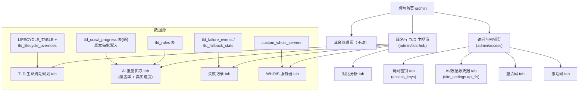

# 后台管理控制台重构 — 技术设计

Feature Name: admin-console-reorg
Updated: 2026-09-07

## Description

将分散重复的后台管理页按功能域合并为两个核心管理页：

1. **「域名与 TLD」管理中枢页**：整合 TLD 生命周期规划、AI 批量抓取（实时覆盖率 + 真实批处理进度）、失败记录统计、WHOIS 服务器管理、生命周期对比分析；修正进度分母为实时 IANA 清单；后台脚本进度持久化落库供页面轮询。
2. **「访问与密钥」单页**：合并 `/admin/access-control`（访问密钥/邀请码/激活码）与 `/admin/api`（AI 提供商 Key/第三方数据源凭据）；抽取公共 code 生成/有效期工具删除重复逻辑；移除 system.ts 冗余清理入口。

旧路由保持可访问（重定向至新页面对应 tab），其余管理域不受影响。

## Architecture

### 整体结构



### 路由策略

| 旧路由 | 目标 | 策略 |
|---|---|---|
| `/admin/tld-rules` | `/admin/tlds-hub?tab=lifecycle` | Next.js 页面内 `useEffect` 检测路径并 `router.replace`，保留 `?inner=failures` → `?tab=failures` |
| `/admin/tld-failures` | `/admin/tlds-hub?tab=failures` | 同上 |
| `/admin/whois-servers` | `/admin/tlds-hub?tab=whois` | 同上 |
| `/admin/access-control` | `/admin/access` | 页面更名，tab 结构保留 |
| `/admin/api` | `/admin/access?tab=providers` | `useEffect` 重定向 |

说明：旧页面保留为薄壳（仅 `router.replace` 重定向组件），不删除文件，避免死链与书签失效；深链参数保持直达。

## Components and Interfaces

### 1. 「域名与 TLD」中枢页 `src/pages/admin/tlds-hub.tsx`

以 `?tab=` 深链驱动，5 个 tab。各 tab 组件来源：

| Tab | 组件 | 来源（迁移自） |
|---|---|---|
| `lifecycle` | `LifecycleTabInline` 整体 | `tld-rules.tsx:326`（AI 导入/订阅同步/覆盖表/反馈审核） |
| `crawl` | 进度总览（覆盖率）+ BatchPanel 单TLD抓取/批量 | `tld-rules.tsx:1666` 顶部区块 + `tld-rules.tsx` cc/gtld tab 的 BatchPanel |
| `failures` | 失败统计完整版 | `tld-failures.tsx` `TldFailuresPage` 主体 |
| `whois` | WHOIS 服务器 CRUD | `whois-servers.tsx` `AdminWhoisServersPage` 主体 |
| `compare` | 对比分析 | `tld-rules.tsx` compare tab |

**拆分方式**：因 tld-rules.tsx 2445 行、tld-failures.tsx 1797 行均为单文件巨型组件，本重构采用「新建中枢页 + 子组件文件化」：每个 tab 拆为独立文件（`src/pages/admin/hub/` 下 `lifecycle-tab.tsx`、`crawl-tab.tsx`、`failures-tab.tsx`、`whois-tab.tsx`、`compare-tab.tsx`），从中枢页按 tab 懒加载渲染。原文件保留作旧路由重定向壳，**逐步迁移**而非一次性重写，降低回归风险。

**BatchPanel 保留**：`BatchRunner` 客户端 singleton 维持现状（浏览器内批处理），同时新增「后台脚本进度」区块展示 `tld_crawl_progress` 表内容。

### 2. 「访问与密钥」页 `src/pages/admin/access.tsx`

将 `access-control.tsx` 扩展为 4 个 tab：

| Tab | label | 内容 |
|---|---|---|
| `keys` | 访问密钥 | 原 KeysTab（access_keys CRUD + require_api_key 开关） |
| `providers` | AI/数据源凭据 | 原 api.tsx 主体（AI 提供商 Key + WHOIS/数据源 ServiceCard） |
| `invite` | 邀请码 | 原 InviteTab |
| `activation` | 激活码 | 原 ActivationTab |

**迁移方式**：从 `access-control.tsx` 与 `api.tsx` 复制对应区块，`/admin/access-control` 与 `/admin/api` 改为重定向壳。AI_PROVIDERS 配置、api-keys API 复用不动。

### 3. 后台首页 `src/pages/admin/index.tsx`

- 「域名与接入」分组：`tld-rules` / `?inner=failures` / `?inner=lifecycle` / `tld-failures` 收敛为「域名与 TLD」→ `/admin/tlds-hub`；新增「WHOIS 服务器」→ `/admin/tlds-hub?tab=whois`。
- 「访问与 API」分组：`access-control` + `api` 收敛为「访问与密钥」→ `/admin/access`。
- 统计卡片「查询失败域名」href 更新为 `/admin/tlds-hub?tab=failures`。

### 4. 抓取进度落库与轮询

**新表 `tld_crawl_progress`**（单行，upsert）：

```sql
CREATE TABLE IF NOT EXISTS tld_crawl_progress (
  run_key    TEXT        PRIMARY KEY,          -- 'iana' / 'cc' / 'gtld' / 自定义
  status     TEXT        NOT NULL DEFAULT 'idle',  -- idle|running|done|stopped
  done       INTEGER     NOT NULL DEFAULT 0,
  total      INTEGER     NOT NULL DEFAULT 0,
  ok         INTEGER     NOT NULL DEFAULT 0,
  skipped    INTEGER     NOT NULL DEFAULT 0,
  errors     INTEGER     NOT NULL DEFAULT 0,
  default_only INTEGER   NOT NULL DEFAULT 0,
  iana_total INTEGER,                            -- 本次实时 IANA 清单数
  current_tld TEXT,
  pid        INTEGER,
  started_at TIMESTAMPTZ,
  updated_at TIMESTAMPTZ NOT NULL DEFAULT NOW()
);
```

**写入方 `scripts/batch-scrape.mjs`**：
- 在 `main()` 启动时 `INSERT ... ON CONFLICT (run_key='iana') DO UPDATE` 初始化（status=running, total=清单数, iana_total=清单数, pid=process.pid）。
- 每个批次（`for` 循环每轮）后 upsert `done/ok/skipped/errors/default_only/updated_at`（复用已有 `stats`）。
- 结束时置 `status=done|stopped`；SIGTERM/SIGINT 钩子中置 `status=stopped`（在 `shuttingDown=true` 处）。
- 失败兜底：若 `pool.end()` 前最后 upsert 失败仅 warn 不中断。

**读取方新 API `src/pages/api/admin/tld-crawl-progress.ts`**：
- GET：返回 `tld_crawl_progress` 最新行（run_key='iana' 优先）`{ status, done, total, iana_total, updated_at, ... }` + 当前 DB 覆盖率 `tld_rules` 统计（复用 tld-rules.ts stats 逻辑）。
- POST（admin only）：仅调试用，可手动将 status 置 idle/stopped。

**页面轮询**：`crawl-tab.tsx` 每 15s 拉取一次；非 running 时停止轮询；显示「后台脚本进度」横幅（status / done/total / 时间戳），与 BatchPanel 的浏览器批处理进度并排区分。

### 5. 访问控制去重

**公共工具 `src/lib/code-utils.ts`**（新建）：

```ts
export function genHumanCode(): string;   // randomBytes(3) → 'XXX-XXX-XXX'
export function parseExpiresAt(expires?: string): Date | null;  // 合并 invite/activation 两份重复实现
```

**改造**：
- `src/pages/api/admin/invite-codes.ts` 与 `activation-codes.ts` 改为导入以上工具，删除各自重复的 `genCode`/`parseExpiresAt`。
- `src/pages/api/admin/system.ts` 移除对 `access_keys` 的过期清理逻辑（计数保留或一并移除以保持单一职责），清理入口只保留在 `/admin/access?tab=keys`。

## Data Models

- `tld_crawl_progress`：见上（新增，仅一行常驻，`run_key='iana'`）。
- 其余表（`tld_rules` / `tld_lifecycle_overrides` / `tld_failure_events` / `tld_fallback_stats` / `custom_whois_servers` / `access_keys` / `invite_codes` / `activation_codes` / `site_settings`）结构不变。

## Correctness Properties

1. 进度分母 = 脚本实时 IANA 清单数（运行时值），不再是写死 1285；前端兜底用「缓存的上次已知总数 + 标注」而非常量。
2. 覆盖率（`tld_rules` 行数/IANA 总数）与真实批处理进度（done/total）是两个独立展示，互不替代。
3. 后台脚本进度在浏览器刷新后仍可见（来自 DB），不依赖内存 singleton。
4. 旧路由全部可达：`/admin/tld-rules`、`/admin/tld-failures`、`/admin/whois-servers`、`/admin/access-control`、`/admin/api` 均不 404，重定向目标正确、深链参数保留。
5. `tld_crawl_progress` 写入幂等（upsert on run_key），重复运行不产生多行。
6. 非重构域路由、API 响应结构不变；`tld-rules` API 的 `stats.ianaTotal` 保留字段名，但值改为实时（或缓存）IANA 数，兼容既有前端读取。

## Error Handling

- IANA 清单拉取失败：脚本用上一次已知总数写 `iana_total`，页面标注「缓存」；不阻塞抓取。
- 进度写入失败：仅 console.warn，不中断抓取主流程。
- 页面轮询超时/网络错误：静默重试，不弹错；横幅显示「进度暂不可用」。
- 旧路由重定向：若目标页面加载失败，保持旧页面 shell 可读（重定向在 `useEffect` 客户端执行，SSR 仍渲染旧页面骨架）。

## Test Strategy

- 单元测试：`code-utils`（genHumanCode 格式/唯一性、parseExpiresAt 边界）；`tld-crawl-progress` upsert 幂等逻辑（若抽纯函数）。
- 集成验证（冒烟）：`node scripts/batch-scrape.mjs --tld xxx` 后查 `tld_crawl_progress` 行；页面轮询 GET 返回结构。
- 手动回归清单：
  1. `/admin/tlds-hub` 5 个 tab 均可用，深链直达。
  2. 旧路由 `/admin/tld-rules`、`/admin/tld-failures`、`/admin/whois-servers`、`/admin/api`、`/admin/access-control` 跳转正确。
  3. 后台脚本运行中打开页面，进度横幅 15s 内更新。
  4. `/admin/access` 4 tab 功能（密钥/凭据/邀请/激活）回归。
  5. 首页入口收敛无死链。
  6. `npx tsc --noEmit` 干净。

## References

[^1]: (src/pages/admin/tld-rules.tsx#L326) - LifecycleTabInline 生命周期设置组件
[^2]: (src/pages/admin/tld-rules.tsx#L1666) - AI 抓取进度总览区块（写死 1285 前端兜底）
[^3]: (src/pages/api/admin/tld-rules.ts#L702) - IANA_TOTAL 写死 1285 常量
[^4]: (scripts/batch-scrape.mjs#L1210) - printProgress 进度输出
[^5]: (scripts/batch-scrape.mjs#L1275) - 主循环批次处理
[^6]: (src/pages/admin/tld-failures.tsx#L401) - TldFailuresPage 完整失败统计
[^7]: (src/pages/admin/whois-servers.tsx#L215) - AdminWhoisServersPage WHOIS 服务器 CRUD
[^8]: (src/pages/admin/access-control.tsx#L896) - AccessControlPage 三 tab
[^9]: (src/pages/admin/api.tsx#L71) - AdminApiPage AI Key/数据源
[^10]: (src/pages/api/admin/invite-codes.ts#L6) - genCode 重复实现
[^11]: (src/pages/api/admin/activation-codes.ts#L6) - genActivationCode 重复实现
[^12]: (src/lib/batch-runner.ts) - BatchRunner 客户端 singleton
