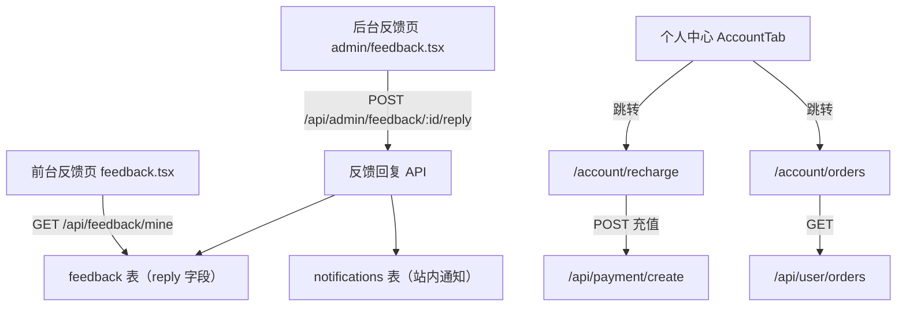

# Account Center & Feedback Reply — Design

Feature Name: account-center-and-feedback-reply
Updated: 2026-09-16

## Description

本特性包含四项改动：
1. **反馈站内回复**：后台反馈处理页新增站内回复表单，回复内容持久化并推送站内通知，前台反馈页新增"我的反馈"历史区。
2. **注册必填用户名**：注册表单用户名由可选改为必填，前后端同步校验。
3. **个人中心显示用户名**：AccountTab 展示用户名，历史账户默认显示邮箱前缀并提供设置引导。
4. **独立购买记录与充值页**：新增 `/account/orders` 与 `/account/recharge` 页面，个人中心余额/购买记录入口改为跳转独立页。

## Architecture



## Components and Interfaces

### 1. 反馈站内回复

**数据模型（feedback 表迁移）**
- 新增列 `reply TEXT`（管理员回复正文）
- 新增列 `replied_at TIMESTAMPTZ`（回复时间）

**后台回复 API** — `src/pages/api/admin/feedback.ts`
- 新增 `POST /api/admin/feedback/:id/reply`，请求体 `{ reply: string }`
- 校验：`reply` 非空、长度 ≤ 2000
- 行为：
  1. `UPDATE feedback SET reply=$1, replied_at=$2, handled=true, handled_at=$3 WHERE id=$4`
  2. 若反馈关联了 user_id，向该用户写入 `notifications` 表一条通知（类型 `feedback_reply`，标题含反馈域名，正文为回复内容），并标注该通知关联 feedback 记录

**数据来源：反馈与用户的关联**
- `feedback` 表需确认是否已有 `user_id` 列。若无，POST 时通过 `email` 匹配 `users` 表查询 userId；匹配不到则仅存储回复，不发送通知。

**前台反馈历史 API** — 新增 `src/pages/api/feedback/mine.ts` 或扩展现有 `GET /api/feedback`
- 返回当前登录用户提交过的反馈列表（含 `query、issue_types、description、reply、replied_at、created_at、handled`）
- 未登录返回空列表

**前台反馈页（`src/pages/feedback.tsx`）**
- 新增"我的反馈"区块，展示反馈历史与回复内容；仅登录用户可见
- 回复内容为空时显示"暂无回复"

**后台反馈页（`src/pages/admin/feedback.tsx`）**
- 展开详情时若存在 `reply` 显示历史回复
- 原 `mailto` 按钮保留为辅助操作，主操作改为"回复"展开内联表单（文本域 + 提交按钮）

### 2. 注册必填用户名

**前端（`src/pages/register.tsx`）**
- `name` 字段去掉"可选"标注，label 调整为必填标记
- 提交前校验 `name.trim()` 非空，空则提示"用户名不能为空"；长度 > 50 提示超限
- 文案修改需同步多语言 i18n keys

**后端（`src/pages/api/user/register.ts`）**
- 校验 `name` 非空，为空返回 400 "用户名不能为空"
- 长度 > 50 返回 400
- 保持写入 `users.name` 的现有逻辑

### 3. 个人中心显示用户名

**`src/components/dashboard/AccountTab.tsx`**
- 用户名展示处：若 `user.name` 为空，显示 `user.email` 的 `@` 前缀作为默认显示名
- 默认名仅用于展示，不写入数据库
- 编辑处引导文案：未设置时提示"设置用户名"

### 4. 独立购买记录页与充值页

**新增页面 `src/pages/account/orders.tsx`**
- 需登录（未登录重定向 `/login`）
- 组件复用 `MembershipTab` / orders 列表 UI（按需抽取公共组件 minimize duplication）
- 数据来自 `/api/user/orders`：展示订单号、套餐名、金额、货币、状态、时间

**新增页面 `src/pages/account/recharge.tsx`**
- 需登录（未登录重定向 `/login`）
- 展示账户余额 + 充值表单，复用 `/payment/checkout` 的支付流程与 `/api/payment/create`
- 充值成功后跳转 `/payment/result` 或余额刷新

**dashboard.tsx 入口修改**
- `onGoRecharge` → `router.push("/account/recharge")`
- `onGoOrders`（余额/购买记录）→ `router.push("/account/orders")`
- 移除原"切换 membership tab + scrollIntoView"逻辑

**导航**
- 个人中心/侧边栏（若有）为 `余额充值`、`购买记录` 增加入口，指向新页面

## Data Models

```sql
-- feedback 表新增
ALTER TABLE feedback ADD COLUMN reply TEXT;
ALTER TABLE feedback ADD COLUMN replied_at TIMESTAMPTZ;

-- notifications 表（现有，确认字段满足）
-- id, user_id, title, body, link, read_at, created_at ...
```

## Correctness Properties

- 站内回复非空才可提交，提交后 `handled=true` 且 `replied_at` 有值。
- 回复通知仅当能解析到 user_id 时发送；否则仅存储回复，不影响处理器成功返回。
- `/account/orders`、`/account/recharge` 未登录一律 302 到 `/login`。
- 老用户无用户名时默认显示邮箱前缀，个人资料编辑仍以 `users.name` 为准，不污染数据库。
- 充值页金额校验沿用现有 `/api/payment/create` 逻辑，不新增风险面。

## Error Handling

| 场景 | 处理 |
|------|------|
| 回复内容为空 / 超长 | 后端 400 + 前端 toast 提示 |
| 反馈记录不存在 | 回复 API 返回 404 |
| 通知发送失败 | 捕获异常，不影响回复存储与成功返回（日志记录） |
| 充值提交失败 | 沿用现有支付错误处理与 result 页展示 |
| 未登录访问独立页 | 服务端重定向 `/login` |

## Test Strategy

- **单元测试**：
  - 反馈回复 API：空回复 400、正常回复更新 handled/replied_at/reply、无用户时仅存储不通知
  - 注册接口：空用户名 400、长度超限 400、正常注册写入 name
  - 邮箱前缀默认名函数（纯函数）
- **集成验证**：vitest 覆盖关键路径；Playwright 抽样验证 `/account/orders`、`/account/recharge` 登录拦截与渲染
- **回归**：tsc、vitest 全量、next build

## References

[^1]: (Filename) - `src/pages/admin/feedback.tsx` — 后台反馈页（mailto 回复、handled 切换）
[^2]: (Filename) - `src/pages/api/admin/feedback.ts` — 反馈管理 API（GET/PATCH/DELETE）
[^3]: (Filename) - `src/pages/register.tsx` — 注册页（name 可选）
[^4]: (Filename) - `src/pages/api/user/register.ts` — 注册 API（支持 name）
[^5]: (Filename) - `src/components/dashboard/AccountTab.tsx` — 个人中心（用户名展示）
[^6]: (Filename) - `src/pages/dashboard.tsx` — dashboard（余额/购买记录跳转）
[^7]: (Filename) - `src/pages/api/user/orders.ts` — 订单列表 API
[^8]: (Filename) - `src/pages/api/user/balance-transactions.ts` — 余额记录 API
[^9]: (Filename) - `src/pages/payment/checkout.tsx` — 充值流程