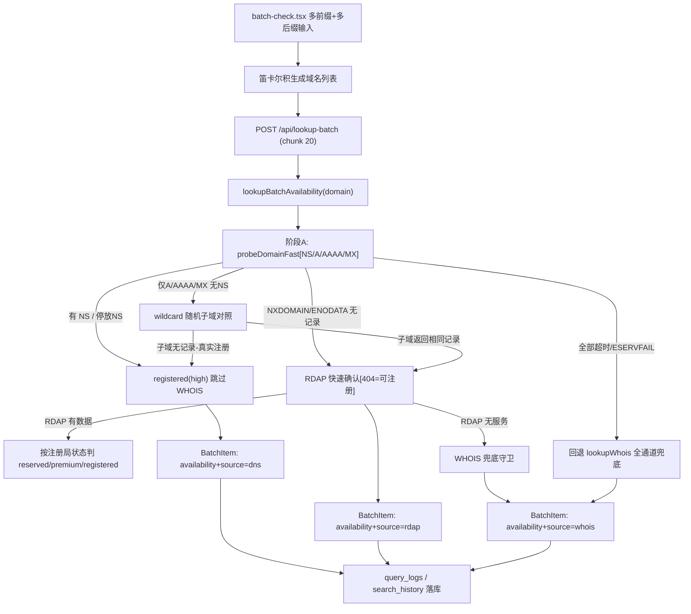

# 批量前缀可用性检测增强（DNS 优先）

Feature Name: batch-availability-dns-first
Updated: 2026-09-10

## Description

将 `/batch-check` 批量查询页从「单前缀 × TLD 分组」升级为「多前缀 × 多后缀笛卡尔积」，并把可用性判定改为 **DNS 优先、WHOIS/RDAP 兜底** 的两段式探测：

- DNS (`probeDomain`) 快，毫秒级；有 NS 或停放 NS 即「已注册」，直接跳过慢速 WHOIS/RDAP。
- DNS 无记录且非超时（NXDOMAIN/ENODATA）判定「可注册高置信候选」，再用 RDAP 快速确认（复用现有 RDAP 404 = 未注册），RDAP 无服务时退 WHOIS。
- DNS 全超时/ESERVFAIL/ambiguous（仅 A/AAAA 无 NS）进入现有 `lookupWhois` 全通道兜底。
- wildcard DNS 通过「随机子域对照探测」识别，避免把可注册域名误标为已注册。
- 保留/溢价/注册局受限状态不得标为可注册（R5）。

本功能只改动批量通道：`/api/lookup-batch` 后端 + `batch-check.tsx` 前端 + `dns-check.ts` 探测增强，单域名结果页链路不动。

## Architecture



判定链路是「阶段A DNS 先跑」→ 只有 DNS 无结论或需要二次确认时才进入阶段B（RDAP/WHOIS）。DNS 结论（registered / unregistered）单独缓存（短 TTL），与既有 WHOIS/RDAP 分层缓存（L1/L2/L3 + SWR）共用同一套缓存基础设施，但使用独立键前缀 `batchdns:`，避免 DNS 短 TTL 结论把已缓存的详细 WHOIS 结果覆盖掉。

## Components and Interfaces

### 1. `src/lib/whois/dns-check.ts`（扩展）

现有 `probeDomain` 保留不动（单查询页在用）。新增：

- `probeDomainFast(domain): Promise<FastProbeResult>` —— 无 SSL 探测、缩短超时（NS/A/AAAA/MX 四类并行，`DNS_TIMEOUT_MS` 降至 ~2500ms），返回：

```ts
export type FastProbeResult = {
  domain: string;
  registrationStatus: "registered" | "unregistered" | "unknown";
  confidence: "high" | "medium" | "low";
  nameservers: string[];
  ipv4: string[];
  ipv6: string[];
  mx: string[];
  isWildcardA: boolean;          // TLD 对未注册域名启用通配 A 应答
  parked: boolean;               // NS 指向停放平台
  parkingProvider: string | null;
  allTimedOut: boolean;
};
```

- `detectWildcardA(domain): Promise<boolean>` —— 在仅 A/AAAA/MX 无 NS 时调用：解析 `{random}.{domain}` 随机子域，若其 A/AAAA 与目标一致且非空，判为通配应答 true。
- 复用现有 `withDnsTimeout`（NXDOMAIN/ENODATA → `[]`，超时/ESERVFAIL → `null`）以保证「空记录」与「无应答」严格区分。

### 2. `src/lib/whois/lookup.ts`（新增公开函数）

- `lookupBatchAvailability(domain): Promise<BatchAvailability>` —— DNS 优先两段式判定，输出：

```ts
export type BatchAvailability = {
  registration: "available" | "registered" | "reserved" | "premium" | "unknown";
  confidence: "high" | "medium" | "low";
  source: "dns" | "rdap" | "whois" | "mixed";
  dnsProbe?: FastProbeResult;
  result?: WhoisAnalyzeResult;   // RDAP/WHOIS 兜底产出的详细数据
  error?: string;
};
```

阶段逻辑：

1. 查 `batchdns:` 缓存 → 命中直接返回（TLT 短，见缓存节）。
2. 跑 `probeDomainFast`：
   - 有 NS 或 parked → `registered`，`source: "dns"`，不再查 WHOIS/RDAP。
   - 无 NS 仅 A/AAAA/MX → `detectWildcardA`：通配 → 走「unregistered 候选 + RDAP 确认」；非通配 → `registered`（真实站点有 A 记录）。
   - NXDOMAIN/ENODATA 全空 → 进入「unregistered 候选」。
   - `allTimedOut` 或 `unknown` → 进入全通道兜底（现有 `lookupWhois`）。
3. Unregistered 候选确认：
   - 调 `lookupRdap(domain)`（复用现有模块，含 IANA bootstrap/completion set）：
     - RDAP 404 且无数据 → `available`（`source: "rdap"`）。
     - RDAP 有数据 → 按 `convertRdapToWhoisResult` 结果检查 `status[]`（registry-reserved/premium → `reserved`/`premium`；否则 `registered`），`source: "rdap"`。
     - RDAP bootstrap 无服务（本 TLD 无 RDAP，bootstrap 404）→ 退 WHOIS 守卫（`lookupWhois`）。
4. 兜底守卫：调用现有 `lookupWhoisWithCache(domain)` 将其 `dnsProbe?/status/error/result` 归一化为 `BatchAvailability.registration`（`source: "whois"`），并保留其"未注册"判定（`unregisteredResult` 已带 `dnsProbe.registrationStatus`）。
5. 结果写入 `batchdns:` 缓存（`available`/`registered` 才缓存；`unknown`/`error` 不缓存）。

> NOTE：复用现有 WHOIS「not registered」文本与 RDAP 404 判定。现有 `lookupWhois` 的 unregistered 结果 `status:false` 且无 `result` —— 归一化时将其映射为 `available`（high 置信），修正当前批量页 `!item.status → error` 无法展示可注册的缺陷。

### 3. `src/pages/api/lookup-batch.ts`（改造）

- 保持输入 `{ domains: string[] }` 不变，`CONCURRENCY=5` 不变。
- 任务函数由 `lookupWhoisWithCache(domain)` 换为 `lookupBatchAvailability(domain)`。
- `BatchItem` 类型扩展：

```ts
export type BatchItem = {
  domain: string;
  status: boolean;           // 语义调整：true=有结论(available/registered/reserved/premium)
  time: number;
  cached?: boolean;
  cachedAt?: number;
  cacheTtl?: number;
  source?: "dns" | "rdap" | "whois" | "mixed" | (原有 whois 来源联合);
  result?: WhoisAnalyzeResult;
  error?: string;
  dnsProbe?: FastProbeResult;
  availability?: "available" | "registered" | "reserved" | "premium" | "unknown";
  confidence?: "high" | "medium" | "low";
};
```

- `status` 归并为「有结论」：`available/registered/reserved/premium → true`、`unknown/error → false`；`source` 由段别填写。
- 日志：`logQuery.success` 改为 `item.status`；`classifyQueryOutcome` 继续使用；`source` 透传 `dns/rdap/whois/mixed`。`saveSearchRecord` 仅在 `item.status && item.result` 时写。

### 4. `src/pages/batch-check.tsx`（改造输入区）

- 新增前缀集合状态：`prefixes: string[]`，输入框支持多值（逗号/换行/空白分隔），校验（去空白、去首尾点、小写化）。
- 后缀：保留现有分组（popular/gtld/cctld/all/custom）。自定义后缀与各分组后缀 **合并去重** 参与组合（即分组选中 + 自定义同时生效）。
- 笛卡尔积：`domains = prefixes × (groupTlds ∪ customTlds)`，去重。
- 组合总数前置校验：> 上限（匿名 10 / 登录 500）时阻止发起并 toast 提示。
- 结果行沿用`StatusBadge`；新增小型来源徽标（DNS / RDAP / WHOIS / 混合），来源在 `item.source` 上。
- `getDomainStatus` 改为优先读 `item.availability`（R6 分类不变：available/registered/reserved/premium/error）。
- CSV 导出新增「判定来源」列。

### 5. `src/components/query/AvailableDomainCard.tsx`（不动）

批量页结果行表格与单查卡片解耦，不引用该组件；`info_login_for_more`、`err_*` 等文案不受影响。

## Data Models

### `FastProbeResult`（新增）

见 Components §1。与现有 `DnsProbeResult` 的区别：无 `signals`/`hasSsl`、含 `isWildcardA`/`parked`、`parking` 扁平化为布尔 + provider。

### 缓存键与 TTL

| 缓存 | 键 | TTL | 内容 |
|------|----|-----|------|
| batch DNS 结论 | `batchdns:{asciiDomain}` | 15s（available）/ 15s（registered） | `BatchAvailability` 轻量子集（registration/source/confidence） |
| 既有 WHOIS/RDAP（L1/L2/L3） | `whois:{...}` | 既有（小时级） | 详细 `WhoisResult` |

理由：DNS 结论寿命短（域名随时可能被注册），用长 TTL 会长时间显示已过时的「可注册」。既有详细缓存保留长 TTL，供单查与历史记录复用，互不污染。

### CSV 导出格式

```csv
Domain,Status,Registrar,Expires,Cached,Verification Source
exam.com,available,,,no,rdap
real.com,registered,Namecheap,2030-01-01,no,dns
```

## Correctness Properties

1. **DNS 有 NS/停放 NS ⇒ 已注册，必不标可注册。** `registered` 结论不得被后续兜底改写为 available。
2. **NXDOMAIN / ENODATA（真实应答）⇒ 未注册候选，但必须经 RDAP/WHOIS 确认才最终标 available。** 防止「已注册但未配 DNS」与「保留/溢价」被误判。
3. **wildcard A 应答 ⇒ 视为未注册候选，不得直接标已注册。** 随机子域对照是判定通配的唯一依据。
4. **allTimedOut / ESERVFAIL ⇒ 无可用证据，标 unknown，禁止标可注册（高置信欺骗）。**
5. **保留 / 溢价 / 阻止 / 注册局规避状态 ⇒ 覆盖为 reserved/premium，禁止 available。** `.cn` 保留词（`getCnReservedSldInfo`）路径优先于本流程。
6. **`available` 必有 source（dns/rdap/whois/mixed），不得缺省。** 前端靠它显示依据徽标。
7. **限流、`require_login`、批大小上限、日志、统计口径与改造前一致。**

## Error Handling

| 场景 | 处理 |
|------|------|
| DNS 全部超时 / ESERVFAIL | 进入 `lookupWhois` 全通道；仍无结论 → `unknown`，前端显示错误/灰色，不显示可注册 |
| RDAP bootstrap 无服务（本 TLD 无 RDAP，404） | 退 WHOIS 守卫 `lookupWhoisWithCache` |
| RDAP 超时或无数据 | 退 WHOIS；WHOIS 也未注册文本 → `available`（沿用 `WHOIS_NOT_REGISTERED_PATTERNS`） |
| 随机子域解析失败 | wildcard 判定不成立，按「仅 A/AAAA 无 NS → ambiguous」进入兜底，不直接下结论 |
| WHOIS 包装异常 / 第三方 API（scraper）异常 | `unknown` + error 信息透传前端，不中断批量 |
| 前端组合数超上限 | 发起前拦截并提示，不发送请求 |
| CSV 乱码 | 沿用现有 `"..."` 转义 + UTF-8 BOM 前缀追加 |

## Test Strategy

- `src/lib/whois/__tests__/dns-check.test.ts`（新增）：
  - mock `dns.resolveNs/resolve4/resolve6/resolveMx`，覆盖：有 NS、仅 A 无 NS、NXDOMAIN 全空、全超时、ESERVFAIL、wildcard 对照真假。
- `src/lib/whois/__tests__/lookup-batch-availability.test.ts`（新增）：
  - mock `probeDomainFast`/`lookupRdap`/`lookupWhoisWithCache`/DB 缓存，断言：DNS registered 短路、RDAP 404 → available、RDAP 有 reserved/premium → 对应状态、bootstrap 404 → WHOIS 守卫、全超时 → unknown、缓存命中（短 TTL）与不缓存 unknown。
- `src/pages/api/lookup-batch.test.ts`（若已有，补充）：
  - 断言 `BatchItem.availability`/`source` 归一化、`status` 语义、日志写入不回归。
- 前端：`batch-check.tsx` 组合逻辑抽纯函数 `buildDomainMatrix(prefixes, tlds)` 并单测（去重、排序、上限计算）。
- 回归：`npx vitest run` 全量（现有 260 tests）+ `npx tsc --noEmit`。
- 手动：dev server 5000 批量页输入多前缀 + 多后缀验证组合数、DNS 徽标、CSV 新列；`example.com`（registered by DNS）与 `example.bb`（available 走兜底）抽查。

## References

[^1]: `src/pages/batch-check.tsx#L43-51` - [getDomainStatus 当前判定（!item.status → error 缺陷）](../../../src/pages/batch-check.tsx)
[^2]: `src/pages/api/lookup-batch.ts#L39-50` - [BatchItem 类型与 CONCURRENCY](../../../src/pages/api/lookup-batch.ts)
[^3]: `src/lib/whois/dns-check.ts#L141-230` - [probeDomain 与 withDnsTimeout 语义](../../../src/lib/whois/dns-check.ts)
[^4]: `src/lib/whois/lookup.ts#L719-754` - [failWithDns / unregisteredResult 未注册判定](../../../src/lib/whois/lookup.ts)
[^5]: `src/lib/whois/lookup.ts#L1037-1039` - [RDAP 404 = 未注册当且仅当 WHOIS 无数据](../../../src/lib/whois/lookup.ts)