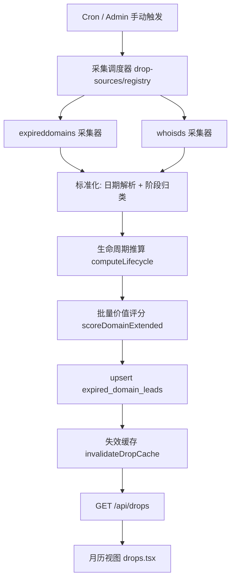
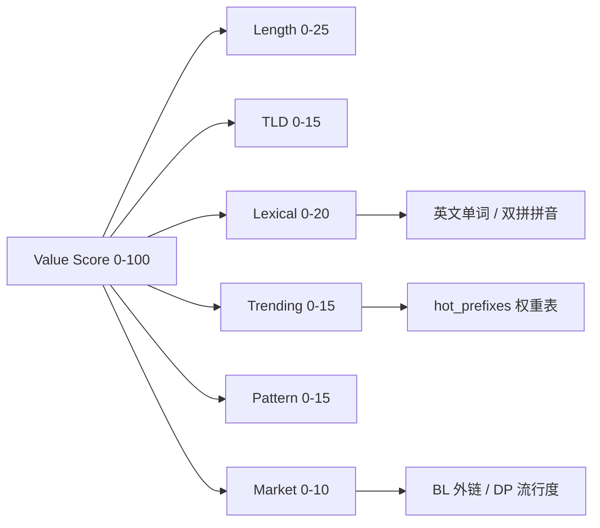

# Design Document — Domain Drop Calendar（掉落日历）

Feature Name: domain-drop-calendar
Updated: 2026-09-22

## Description

将 `/drops` 从历史删除清单升级为未来掉落预告日历。核心由三部分构成：

1. **多源掉落采集**：从 `expireddomains.net` 待删除视图与 `whoisds.com` 每日列表采集未来掉落与当日掉落，标准化为统一的线索记录。
2. **日期推算与校准**：复用 `lifecycle.ts` 对即将过期域名推算精确掉落日与掉落时刻，源提供日期优先。
3. **多维价值评分**：在现有 `scoreDomain` 基础上扩展为七维模型，新增英文单词、中文双拼、动态热门前缀、市场数据四个维度。

## Architecture

### 数据流



### 评分维度构成



## Components and Interfaces

### 采集器层 `src/lib/drop-sources/`

每个采集器实现统一接口：

```typescript
export interface DropSourceAdapter {
  id: string;                       // "expireddomains" | "whoisds"
  stages: DropStage[];              // 该源提供的阶段
  fetch(): Promise<RawDropRow[]>;   // 抓取并解析为原始行
}

export interface RawDropRow {
  domain: string;
  stage: DropStage;                 // "pending_delete" | "expiring" | "deleted"
  dropDate?: string | null;         // 源提供的 YYYY-MM-DD
  expiryDate?: string | null;       // 用于推算
  bl?: number | null;
  dp?: number | null;
  sourceDateType: "source" | "derived";
}
```

- `expireddomains.ts`：复用现有 `expired-domains-crawl.ts` 的登录流程（`/logincheck/` → `member.expireddomains.net/auth/`），新增抓取待删除视图；解析表格日期列。
- `expireddomains-public.ts`：抓取 expireddomains.net 的免登录公开列表 `/deleted-domains/`（已删除，源提供 dropDate）与 `/expired-domains/`（过期，源提供 expiryDate 由生命周期推算 dropDate）；`?start=` 分页，携带浏览器请求头并保持请求间隔以规避限流；无需凭据，开箱即用。
- `whoisds.ts`：下载每日列表（纯文本，每行一个域名），按下载文件的类型归类阶段；无需登录。
- `registry.ts`：按配置顺序调度各适配器，单个适配器失败不影响其他适配器，汇总错误。

### 标准化层 `src/lib/drop-normalize.ts`

- `parseDropDate(text)`：解析多种日期格式（`YYYY-MM-DD`、`DD-MMM-YYYY`、`YYYY`）为 ISO 日期或 null。
- `classifyStage(row)`：按源与状态归类阶段。
- 阶段优先级：`pending_delete`（精确未来）> `expiring`（需推算）> `deleted`（今日已掉落）。

### 推算层（复用）`src/lib/lifecycle.ts`

- 对 `expiring` 阶段且存在 `expiryDate` 的行调用 `computeLifecycle(domain, expiryDate, eppStatuses, overrides)`。
- `dropDate = lc.dropDate`；`dropTime` 由 `lc.dropHour/dropMinute/dropSecond/dropTimezone` 组装。
- EPP 状态含 hold / prohibited / disputed / suspicious 的行剔除。

### 价值评分层 `src/lib/drop-value.ts`

保持 `scoreDomain` 向后兼容（查询页与告警继续使用），新增扩展函数：

```typescript
export interface ValueContext {
  hotPrefixes: Map<string, number>;   // prefix -> weight
  wordSet: Set<string>;               // 英文词表
  pinyinSyllables: Set<string>;       // 有效拼音音节
  pinyinWords: Set<string>;           // 常用拼音词
}

export interface ExtendedValueResult extends DomainValueResult {
  breakdown: {
    lengthScore: number;   // 0-25
    tldScore: number;      // 0-15
    lexicalScore: number;  // 0-20
    trendingScore: number; // 0-15
    patternScore: number;  // 0-15
    marketScore: number;   // 0-10
  };
}

export function scoreDomainExtended(
  domain: string,
  context: ValueContext,
): ExtendedValueResult;
```

- **单词判定** `isDictionaryWord(sld, wordSet)`：精确匹配词表；3-4 字母单词给满分，5-6 字母次之。
- **双拼判定** `splitPinyin(sld, syllables)`：动态规划将纯字母 SLD 切分为 2-4 个有效音节且无剩余；命中 `pinyinWords` 常用词时额外加分。
- **热门前缀**：SLD 全串或子串命中 `hotPrefixes`，取最高权重归一化到 0-15。
- **市场数据**：BL 与 DP 按对数归一化到 0-10，两者取较高权重。

### 数据文件 `src/data/`

- `wordlist.ts`：精选英文常用词（约 2-5 万），导出 `Set<string>`。
- `pinyin.ts`：有效拼音音节表（约 410 个）+ 常用拼音词映射。

选型理由：内置数据文件避免运行时新依赖与网络请求，服务端加载不影响客户端 bundle。

### API 层 `src/pages/api/drops.ts`（改造）

```
GET /api/drops
  ?days=30           窗口天数 1-90
  &sort=value|date|bl
  &tld=com,ai        后缀筛选
  &minLen=&maxLen=   长度区间
  &minScore=         最小价值分
  &source=           来源筛选
  &dateType=         日期类型筛选
```

响应结构：

```typescript
interface DropsResponse {
  today: string;
  days: number;
  public_locked: boolean;
  sources: Array<{
    source: string; stage: string;
    lastSuccessAt: string | null;
    stale: boolean;
  }>;
  drops: Array<{
    date: string;
    total: number;
    topTier: string;
    domains: DropLeadView[];
  }>;
  stats: {
    total: number; today: number;
    tlds: Array<{ tld: string; count: number }>;
    top: DropLeadView[];
  };
  user_drops: Array<{ date: string; domains: Array<{ domain: string; reminder_id: string }> }>;
}

interface DropLeadView {
  domain: string;
  tld: string;
  dropDate: string;
  dropTime: string | null;   // "HH:MM:SS TZ"
  dateType: "source" | "derived";
  source: string;
  valueScore: number;
  valueTier: string;
  reasons: string[];
}
```

缓存策略沿用现有约定：匿名响应 `public, max-age=300, stale-while-revalidate=600`；登录响应 `private, no-store`。

### 定时采集 `src/pages/api/cron/drop-sources.ts`

- 认证复用现有 `CRON_SECRET` Bearer 机制。
- 每日执行：采集 → 标准化 → 推算 → 评分 → upsert → 失效缓存。
- 单次运行写入 `drop_source_status` 状态行。

### 视图层 `src/pages/drops.tsx`（改造）

- 顶部：统计概览（窗口总数、今日掉落、后缀分布、Top 价值）。
- 主体：月历网格，日期格显示数量与最高价值等级；点击展开当日列表。
- 每行：域名、掉落日/时刻、来源与日期类型标记、价值分与等级、监控提醒按钮（管理员额外显示加入抢注）。
- 筛选栏：后缀、长度、最小价值分、来源、日期类型、排序。
- 数据源新鲜度提示条。

## Data Models

### 扩展 `expired_domain_leads`

```sql
ALTER TABLE expired_domain_leads
  ADD COLUMN IF NOT EXISTS drop_date    DATE,
  ADD COLUMN IF NOT EXISTS expiry_date  DATE,
  ADD COLUMN IF NOT EXISTS stage        TEXT NOT NULL DEFAULT 'deleted',
  ADD COLUMN IF NOT EXISTS date_type    TEXT NOT NULL DEFAULT 'source',
  ADD COLUMN IF NOT EXISTS value_score  INT,
  ADD COLUMN IF NOT EXISTS value_tier   TEXT,
  ADD COLUMN IF NOT EXISTS value_reasons JSONB;

CREATE INDEX IF NOT EXISTS idx_edl_drop_date  ON expired_domain_leads (drop_date);
CREATE INDEX IF NOT EXISTS idx_edl_stage      ON expired_domain_leads (stage);
CREATE INDEX IF NOT EXISTS idx_edl_value      ON expired_domain_leads (value_score DESC NULLS LAST);
```

说明：复用现有表而非新建，保持单一事实源；`available_date` 保留兼容，新逻辑以 `drop_date` 为准。

### 新增 `drop_source_status`

```sql
CREATE TABLE IF NOT EXISTS drop_source_status (
  source          TEXT PRIMARY KEY,
  enabled         BOOLEAN NOT NULL DEFAULT true,
  last_success_at TIMESTAMPTZ,
  last_error      TEXT,
  last_error_at   TIMESTAMPTZ,
  items_last_run  INT NOT NULL DEFAULT 0
);
```

### 复用 `hot_prefixes`

评分时预加载 `SELECT prefix, weight FROM hot_prefixes WHERE enabled = true`，复用现有 `HOT_PREFIX_CACHE_KEY` 缓存与失效逻辑。

## Correctness Properties

1. **幂等性**：同一域名重复采集只更新不新增（`domain` 唯一约束 + upsert）。
2. **日期优先级**：源提供日期始终覆盖推算日期，推算偏差记录供核对。
3. **评分稳定性**：`scoreDomainExtended` 对相同域名与相同 `ValueContext` 返回相同结果。
4. **窗口边界**：返回结果满足 `today <= drop_date <= today + days`。
5. **阶段互斥**：一条线索同一时刻只有一个 `stage`。
6. **缓存隔离**：任何含 `user_drops` 的响应必须为 `private, no-store`。
7. **剔除规则**：EPP 含 hold/prohibited/disputed/suspicious 的域名不出现在未来窗口。
8. **分数区间**：各维度分不超过上限，总分不超过 100。

## Error Handling

| 场景 | 处理 |
|---|---|
| 单个采集源失败 | 保留该源上次成功数据，写入 `drop_source_status.last_error`，其他源继续 |
| 行日期解析失败 | 跳过该行并计入错误计数 |
| TLD 无生命周期规则 | 回退行业默认值并标记低置信度 |
| RDAP/WHOIS 查询失败 | 保留上次 `expiry_date`，不做推算更新 |
| DB 不可用 | 返回 503 `Service temporarily unavailable` |
| 词表/拼音数据加载失败 | 降级为不含对应维度评分，其余维度正常 |

## Test Strategy

- **单元测试**：`parseDropDate` 多格式、`splitPinyin` 切分（含失败用例）、`isDictionaryWord`、各评分维度边界（单字符、双字符、含连字符）、窗口过滤、阶段归类。
- **集成测试**：采集器以 fixture（HTML/文本）验证解析；`/api/drops` 响应结构与筛选参数；匿名与登录缓存头。
- **回归**：现有 612 个测试保持通过；`npx tsc --noEmit` 零错误；`scripts/check-locale-keys.mjs` 8 个 locale 文件同步。
- **数据验证**：对真实 DB 执行采集后校验 `drop_date` 分布、`stage` 计数、`value_score` 非空比例。

## References

[^1]: (Filename#L1) - [现有掉落 API](/workspace/src/pages/api/drops.ts)
[^2]: (Filename#L1) - [现有掉落页面](/workspace/src/pages/drops.tsx)
[^3]: (Filename#L1) - [TLD 生命周期引擎](/workspace/src/lib/lifecycle.ts)
[^4]: (Filename#L214) - [现有价值评分 scoreDomain](/workspace/src/lib/domain-value.ts)
[^5]: (Filename#L1) - [热门前缀管理与 AI 发现](/workspace/src/pages/api/admin/hot-prefixes.ts)
[^6]: (Filename#L123) - [现有过期域名爬虫解析](/workspace/src/pages/api/admin/expired-domains-crawl.ts)
[^7]: (Filename#L558) - [expired_domain_leads 表定义](/workspace/src/lib/db.ts)
[^8]: (Filename#L1) - [域名 AI 深度估值](/workspace/src/lib/server/domain-value-ai.ts)
[^9]: (Filename#L1) - [掉落抢注规范](/workspace/.monkeycode/specs/domain-drop-sniping/requirements.md)
