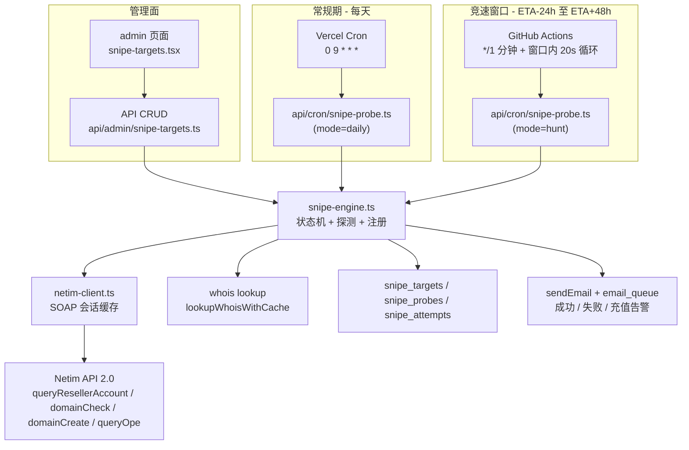
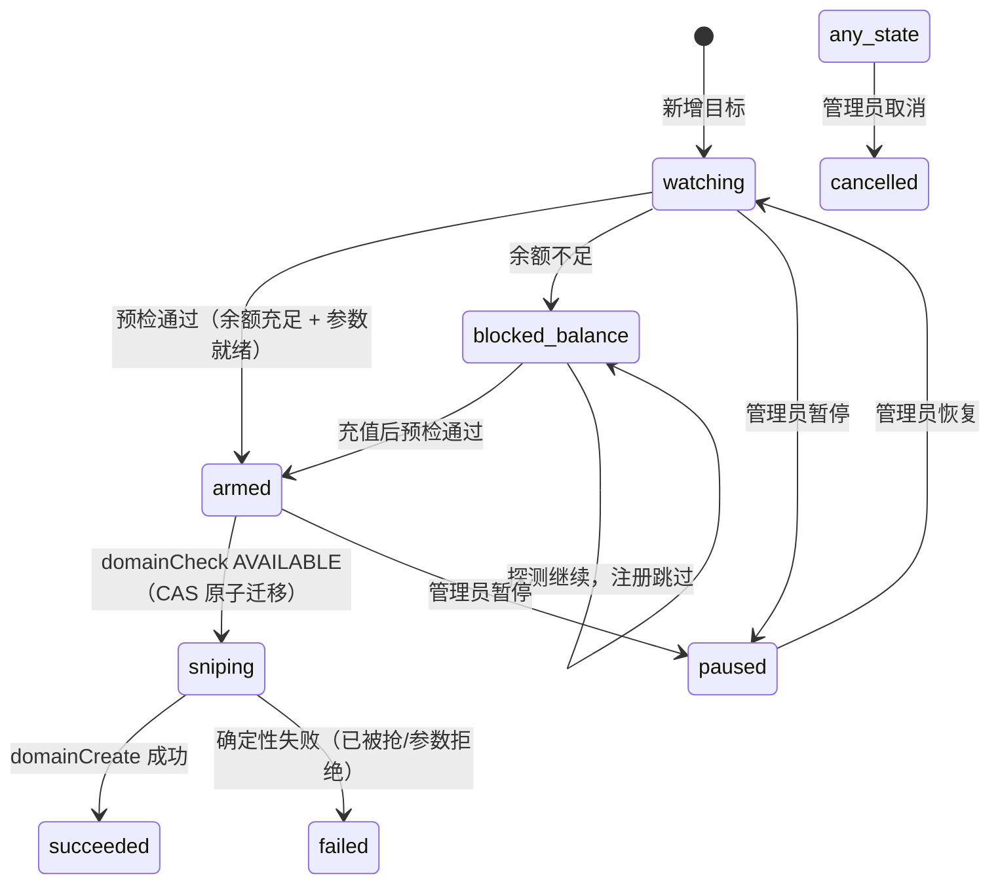

# Domain Drop Sniping — 技术设计

Feature Name: domain-drop-sniping
Updated: 2026-09-12

## Description

为管理员提供"到期域名掉落自动抢注"能力：目标管理（admin 后台）、常规期生命周期跟踪、掉落日 GitHub Actions 高频竞速探测、Netim `domainCheck` 权威确认、`domainCreate` 自动注册、全链路审计与邮件通知。

已验证的关键前提（2026-09-12 API 实测）：Netim SOAP 2.0 可用、支持 `.sb`、`domainCheck` ~600ms、无官方 backorder、账户余额 €50 < f.sb 注册价 €60.50、默认联系人（LJ5552/LJ5551）与默认 DNS（ns1/ns2.nic.bn）已配置。

## Architecture



分层职责：

1. **netim-client.ts**（纯协议层）：从 `src/lib/server/premium-check.ts` 提取并复用 SOAP 框架（`soapEnvelope`/`escapeXml`/`xmlValue`/会话缓存），新增 `queryResellerAccount`、`domainCheck`、`domainCreate`、`queryOpe` 四个调用与解析。`premium-check.ts` 改为引用该模块，消除重复。
2. **snipe-engine.ts**（业务状态机）：目标 claim、探测编排、释放判定、注册动作、审计落库、邮件通知。提供 `SNIPE_DRY_RUN=1` 干跑模式。
3. **snipe-probe 端点**（触发入口）：`mode=daily`（Vercel cron，全部 active 目标）与 `mode=hunt`（仅 hunt 窗口内目标），认证复用 CRON_SECRET/admin session 模式。
4. **GitHub Actions workflow**：`*/1` 分钟调度，单次运行内做 3 次探测（间隔 20s），`concurrency` 防堆积；目标清单与域名只存在于服务端，workflow 与日志脱敏（只回传 target id 与结果枚举）。

## Components and Interfaces

### 1. `src/lib/server/netim-client.ts`（新增）

```ts
// 复用 premium-check 的会话缓存与 SOAP 封装
export async function netimQueryResellerAccount(): Promise<{ balance: number } | null>;
export async function netimDomainCheck(domain: string): Promise<{
  available: boolean; reason: string;   // reason: FREE | PREMIUM | IN_USE | ...
} | null>;
export async function netimDomainCreate(domain: string, periodYears: number): Promise<{
  ok: boolean; opeId?: string; price?: number; reason?: string; transient: boolean;
} | null>;
export async function netimQueryOpe(opeId: string): Promise<{
  status: "done" | "pending" | "error"; comment?: string;
} | null>;
```

- 确定性失败（`NOT AVAILABLE`/参数拒绝）→ `transient: false`；网络/超时/5xx → `transient: true`。
- 会话 20 分钟 TTL 缓存沿用；401/会话失效自动重开一次（沿用 premium-check 模式）。

### 2. `src/lib/server/snipe-engine.ts`（新增）

```ts
export async function runDailyProbe(): Promise<ProbeSummary>;   // Vercel cron
export async function runHuntProbe(): Promise<ProbeSummary>;    // GitHub Actions
async function probeTarget(t: SnipeTarget): Promise<TargetOutcome>;
```

`probeTarget` 流程（单目标单流程）：

1. **Claim**：`UPDATE snipe_targets SET probe_lock_at = NOW() WHERE id = $1 AND (probe_lock_at IS NULL OR probe_lock_at < NOW() - INTERVAL '120 seconds') RETURNING *` — 未 claim 到则跳过（另一进程在跑）。
2. **WHOIS 快查**：`lookupWhoisWithCache(domain)`，8s 超时（与 `remind/process.ts` 一致）。结果落 `snipe_probes`。
3. **疑似释放判定**：WHOIS 无记录 / status 含 available / 注册数据消失 → 进入权威确认。
4. **Netim 权威确认**：`netimDomainCheck(domain)`。AVAILABLE → 步骤 5；NOT AVAILABLE → 记录、清锁、返回。
5. **注册预检**：实时 `queryDomainPrice`，`price <= max_price` 且账户余额充足 → CAS 迁移状态 `armed → sniping`。
6. **注册**：`netimDomainCreate(domain, 1)`（默认联系人 + 默认 DNS）。`transient` 失败按 1s/4s/16s 退避重试至多 3 次；返回 `opeId` 但结果未知时用 `netimQueryOpe` 轮询（至多 3 次 × 5s）。
7. **收尾**：状态迁移 `succeeded`/`failed`，审计行写入 `snipe_attempts`，发送邮件，清锁。

### 3. `src/pages/api/cron/snipe-probe.ts`（新增）

- 认证：`Authorization: Bearer ${CRON_SECRET}` 或 admin session（照抄 `remind/process.ts:148` 双通道模式）。
- `mode=daily`（默认）：全量 active 目标各探测一次 + 刷新 drop ETA + 武装预检（余额/价格）。
- `mode=hunt`：仅 `hunt_start <= NOW() <= hunt_end` 的目标；响应只含 `{ checked: n, results: [{ id, outcome }] }`，域名脱敏。

### 4. `src/pages/api/admin/snipe-targets.ts`（新增，admin session 保护）

`GET` 列表（含最近探测）、`POST` 新增（WHOIS 初始化）、`PATCH /:id`（pause/resume/cancel/max_price）、`DELETE /:id`（仅 cancelled 可删）。

### 5. `src/pages/admin/snipe-targets.tsx`（新增页面）

沿用 admin 后台现有页面骨架（参考 `reminders.tsx`）：目标表格（域名、状态徽章、drop ETA、预估价/上限、余额状态）、新增对话框、操作按钮（武装/暂停/取消）。状态徽章用现有黑白极简风格。

### 6. `.github/workflows/snipe-hunt.yml`（新增）

```yaml
on:
  schedule: [{ cron: "*/1 * * * *" }]
  workflow_dispatch: {}
concurrency: { group: snipe-hunt, cancel-in-progress: true }
```

- 单次 job：拉取 hunt 窗口目标（脱敏）→ 循环 3 次 `POST /api/cron/snipe-probe?mode=hunt`（间隔 20s）→ 退出。总时长 < 2 分钟，与下一轮调度重叠由 DB claim 去重。
- Secrets：`SNIPE_ENDPOINT`（生产 URL）、`SNIPE_TOKEN`（CRON_SECRET）。
- repo 为 public，域名/参数均在服务端，日志仅含枚举结果。

### 7. 邮件通知（`src/lib/email.ts` 增补）

新增 `snipeNotifyHtml(title, lines)` 内部模板（复用 monochrome `emailLayout` 基础组件），三个场景：抢注成功（含域名/价格/操作号）、抢注失败（含原因）、充值告警（24h 限频，状态存 `snipe_targets.meta` 或独立 kv）。收件人 `ADMIN_EMAIL`，文案中文固定（管理员专用，无 i18n 需求）。

## Data Models

```sql
CREATE TABLE IF NOT EXISTS snipe_targets (
  id              UUID          PRIMARY KEY DEFAULT gen_random_uuid(),
  domain          TEXT          NOT NULL UNIQUE,
  tld             TEXT          NOT NULL DEFAULT '',
  status          TEXT          NOT NULL DEFAULT 'watching',
  -- watching | armed | blocked_balance | sniping | succeeded | failed | cancelled | paused
  max_price       NUMERIC(10,2),
  est_price       NUMERIC(10,2),
  is_premium      BOOLEAN,
  expiration_date DATE,
  drop_eta        DATE,
  hunt_start      TIMESTAMPTZ,
  hunt_end        TIMESTAMPTZ,
  last_epp        TEXT,
  last_whois_at   TIMESTAMPTZ,
  whois_fails     INT           NOT NULL DEFAULT 0,
  probe_lock_at   TIMESTAMPTZ,
  registered_at   TIMESTAMPTZ,
  netim_ope_id    TEXT,
  final_price     NUMERIC(10,2),
  fail_reason     TEXT,
  notes           TEXT,
  created_at      TIMESTAMPTZ   NOT NULL DEFAULT NOW(),
  updated_at      TIMESTAMPTZ   NOT NULL DEFAULT NOW()
);
CREATE INDEX IF NOT EXISTS idx_snipe_targets_status ON snipe_targets (status);
CREATE INDEX IF NOT EXISTS idx_snipe_targets_hunt   ON snipe_targets (hunt_start, hunt_end) WHERE status IN ('armed','blocked_balance');

CREATE TABLE IF NOT EXISTS snipe_probes (
  id          BIGSERIAL   PRIMARY KEY,
  target_id   UUID        NOT NULL REFERENCES snipe_targets(id),
  channel     TEXT        NOT NULL,   -- whois | netim_check | netim_create
  result      TEXT        NOT NULL,   -- registered | maybe_free | available | not_available | error
  detail      TEXT,
  latency_ms  INT,
  created_at  TIMESTAMPTZ NOT NULL DEFAULT NOW()
);
CREATE INDEX IF NOT EXISTS idx_snipe_probes_target ON snipe_probes (target_id, created_at DESC);

CREATE TABLE IF NOT EXISTS snipe_attempts (
  id              BIGSERIAL    PRIMARY KEY,
  target_id       UUID         NOT NULL REFERENCES snipe_targets(id),
  check_available BOOLEAN,
  params_snapshot TEXT,                    -- JSON: 默认联系人/DNS 快照
  netim_response  TEXT,                    -- 原始 XML（已脱敏，无凭证）
  ope_id          TEXT,
  outcome         TEXT         NOT NULL,   -- succeeded | failed_permanent | failed_transient | unknown_pending
  price           NUMERIC(10,2),
  created_at      TIMESTAMPTZ  NOT NULL DEFAULT NOW()
);
```

建表语句加入 `src/lib/db.ts` 的 MIGRATIONS 数组（沿用现有 `CREATE TABLE IF NOT EXISTS` + `ALTER TABLE ... ADD COLUMN IF NOT EXISTS` 模式）。

目标状态机：



## Correctness Properties

1. **单飞行注册**：任意时刻同一 target 至多一个注册尝试在执行（`probe_lock_at` claim + `armed → sniping` CAS）。
2. **判定-动作原子性**：`domainCheck` AVAILABLE 与 `domainCreate` 之间以状态 CAS 衔接，注册响应无论成败都产生一条 `snipe_attempts` 审计行。
3. **取消优先**：`cancelled`/`paused` 状态永远不会进入注册路径（probe 入口直接排除）。
4. **预算约束**：实时注册价 > `max_price` 或账户余额 < 注册价时，注册动作 SHALL 被跳过并记录原因。
5. **凭证安全**：`NETIM_PASSWORD` 不出现在日志、HTTP 响应、审计原文中（SOAP 响应本身不含凭证，落库前不做额外过滤也安全，但日志语句禁止拼接凭证）。
6. **干跑安全**：`SNIPE_DRY_RUN=1` 时全流程执行至 `domainCreate` 前一步停止，审计照常落库。

## Error Handling

| 场景 | 处理 |
|---|---|
| WHOIS 连续 3 次失败 | `whois_fails` 计数，发探测异常告警；ETA 保持上次成功值 |
| Netim 会话失效 | 自动重开一次（沿用 premium-check 模式），重开后仍失败则本次探测记 error |
| `domainCreate` 瞬时错误 | 1s/4s/16s 退避重试 ×3；仍失败记 `failed_transient`，目标回 `armed` 等待下轮探测再试 |
| `domainCreate` 超时无结果 | `netimQueryOpe(opeId)` 轮询归类；无法归类记 `unknown_pending` + 人工告警邮件 |
| 余额不足 | 目标 `blocked_balance`；充值告警邮件 24h 限频 |
| GitHub Actions 停摆 | `mode=daily` 每日探测兜底发现释放； missed 窗口由"ETA 已过 7 天仍 armed"的滞留告警暴露 |
| claim 未释放（进程崩溃） | `probe_lock_at` 120s 自动过期，下轮重新 claim |

## Test Strategy

1. **单元测试（vitest）**
   - `netim-client` 解析器：给定真实响应样例 XML（含 Fault、AVAILABLE、NOT AVAILABLE/PREMIUM、StructQueryResellerAccount、ope 查询），断言解析输出（照 `premium-check.test.ts` 的 `priceReply()` 样例模式）。
   - `snipe-engine` 状态机：mock netim-client 与 lookup，覆盖 watching→armed、blocked_balance、AVAILABLE→create 成功/确定性失败/瞬时重试、预算跳过、claim 并发、dry-run 截断。
2. **集成实测（人工/脚本，一次性）**
   - `netimDomainCheck("f.sb")` → NOT AVAILABLE/PREMIUM（已知基线）；`netimDomainCheck("<随机未注册域>")` → AVAILABLE。
   - `netimDomainCreate` 干跑验证参数合法性（真实注册前先在低价值测试域上人工确认一次）。
3. **端到端演练**：`SNIPE_DRY_RUN=1` 下走完 daily probe → hunt probe → 释放确认全链路，检查审计与邮件（不发真实注册请求）。
4. **回归**：现有 353 vitest 保持全绿；`npm run check:i18n` 不受影响（新邮件模板为管理员中文固定文案，locale 文件零改动）。

## References

[^1]: (Filename#L176) - Netim SOAP 框架与会话缓存 `src/lib/server/premium-check.ts`
[^2]: (Filename#L148) - cron 双通道认证模式 `src/pages/api/remind/process.ts`
[^3]: (Filename#L144) - DB claim 防并发模式 `src/pages/api/cron/tld-scrape.ts`
[^4]: (Filename#L587) - .sb 生命周期规则（grace 30 / 无 redemption）`src/lib/lifecycle.ts`
[^5]: (Filename#L497) - 建表迁移模式 `src/lib/db.ts`
[^6]: (Website) - Netim API 2.0 函数清单（DRS server 页，含 domainCreate/domainCheck/domainTldInfo）`https://api.netim.com/2.0/`
