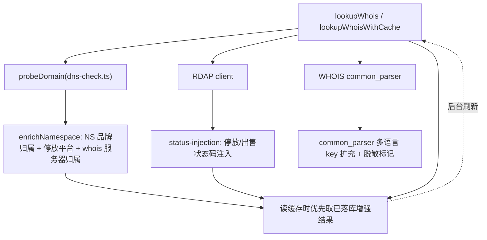

# 域名信息增强 (domain-info-enhancement)

Feature Name: domain-info-enhancement
Updated: 2026-09-13

## Description

对 WHOIS/RDAP 查询结果的**信息深度**做三层增强：

1. **停放/出售检测层**：将现有 10 家停放平台 NS 白名单扩充至 20+ 家静态平台，保持三源交叉判定（RDAP status > WHOIS 文本 > NS 推断）的优先级。
2. **注册商/注册人提取补全**：扩展 common_parser 的多语言 key 覆盖（中文注册局、多语言 ccTLD），注册商缺失 IANA ID 时经内置注册商库补全，隐私代理/脱敏值标记而非留空。
3. **域名综合信息**：NS 归属（复用并扩充 NS_BRANDS）、whois 服务器归属、DNSSEC/DS 补充、WHOIS 日期字段交叉校验（异常标记）。

所有增强结果通过新表 `domain_enrichments` 落库，供重复查询复用。不改变查询主流程、缓存键与 TTL 语义，不新增前端卡片。

## Architecture



**数据流**：`probeDomain` 产出 DNS 信号（NS/IP/MX/parking）→ 新建 `enrichDomainInfo` 服务将 NS 归属、whois 服务器归属、日期校验合并进 `WhoisAnalyzeResult` 的附加字段 → 经 `domain_enrichments` 落库 → 后续相同查询从表读取。缓存链不变：L1 内存 → L2 Redis → DB enrichment 作为第三层（仅当 Redis 未命中时）。

## Components and Interfaces

### 1. `src/data/query-page/parking-platforms.ts`（新建）

静态停放/出售平台库，替代 dns-check.ts 内联的 `PARKING_NS_MAP`：

```ts
export type ParkingPlatform = {
  provider: string;        // 平台名（Sedo / Afternic / 4.cn ...）
  suffixes: string[];      // NS 后缀
  market?: "domestic" | "international";
  listingUrl?: string;     // 域名挂牌查询 URL 模板
  kind: "parking" | "aftermarket" | "both";
};
export const PARKING_PLATFORMS: ParkingPlatform[];
```

dns-check.ts 的 `detectParkingProvider` 改为从该库读取，接口签名不变。

### 2. `src/lib/server/domain-enrichment.ts`（新建）

核心增强服务：

```ts
export type NsAttribution = { ns: string; brand: string | null; kind: "dns-hosting" | "parking" | "registrar" | "unknown" };
export type DomainEnrichment = {
  domain: string;
  nsAttributions: NsAttribution[];        // 每台 NS 的归属
  whoisServerAttribution: string | null;  // whois 服务器归属
  parkingProvider: string | null;         // 停放平台
  forSale: boolean;                        // 三源判定后的出售标记
  dateSanity: { field: string; issue: string }[];
  generatedAt: number;
};
export function enrichDomainInfo(input: { domain; nameservers; whoisServer; registrar; statusCodes; rawText }): Promise<DomainEnrichment>;
```

- NS 归属：NS_BRANDS 扩充后按域名后缀匹配；归属不明 → `brand: null, kind: "unknown"`。
- 停放：`detectParkingProvider(nameservers)` 结果作为信号之一，与 RDAP status / WHOIS 文本合并。
- whois 服务器归属：内置 `WHOIS_SERVER_OWNERS` 映射（注册局/注册商/第三方），未知返回原地址。
- 日期校验：`sanityCheckDates(creationDate, updatedDate, expirationDate)` 返回异常列表。

### 3. `domain_enrichments` 表（db.ts 惰性迁移新增）

```sql
CREATE TABLE IF NOT EXISTS domain_enrichments (
  domain       TEXT PRIMARY KEY,
  enrich_json  JSONB NOT NULL,
  generated_at TIMESTAMPTZ NOT NULL DEFAULT NOW()
);
CREATE INDEX IF NOT EXISTS idx_domain_enrichments_generated_at ON domain_enrichments (generated_at);
```

- TTL 阈值：默认 7 天（`ENRICHMENT_TTL_MS = 7*86400_000`）。
- 读写均 best-effort：失败仅 warn，不阻塞查询。
- 刷新窗口：超过 TTL 的记录在后台重新计算并回写。

### 4. `src/lib/whois/common_parser.ts`（扩展）

- 新增中文 key 变体：注册商（注册商、注册服务商、Registrar 中文行）、注册者（注册者、注册人、持有人、主办单位名称、域名的注册所有者）、联系邮箱（电子邮件、联系人邮箱）等。
- 新增多语言 ccTLD 变体：.vn（Tên miền/Cơ quan đăng ký/Người đăng ký）、.br（Titular/Favorecido）、.kr（등록기관/등록인）、.ru（Регистратор/Владелец）等。
- 脱敏标记：`isRedactedValue` 扩展识别 PrivacyGuard / Whois Privacy / REDACTED FOR PRIVACY 等，产出 `registrantPrivacy: boolean` 附加字段。

### 5. `src/data/query-page/ns-brands.ts`（扩充）

- 在现有 561 行基础上补充主流品牌（含 4.cn 等国内平台、Voodoo、Undirected、Parklogic、Parked.com、DomainSponsor 等），并标记 `kind`（dns-hosting / parking / registrar），用于区分"普通托管"与"停放平台"。

### 6. `src/lib/whois/rdap_client.ts`（轻量扩展）

- 提取 RDAP 的 `publicIds`（IANA 注册商 ID 已在用）、注册商 handle，供注册商库补全 IANA ID 使用。

## Data Models

`WhoisAnalyzeResult` 新增可选附加字段（保持兼容，前端不强依赖）：

```ts
export type WhoisAnalyzeResult = {
  // ... 现有字段不变
  nsAttributions?: NsAttribution[];        // NS 归属
  whoisServerAttribution?: string | null;
  parkingProvider?: string | null;         // 与 dnsProbe.parking 对齐
  forSale?: boolean;
  dateSanity?: { field: string; issue: string }[];
  registrantPrivacy?: boolean;
  ianaIdFromLibrary?: boolean;             // IANA ID 来自内置库补全
};
```

## Correctness Properties

- **优先级不变**：注册局权威状态（RDAP status）优先于 WHOIS 文本，WHOIS 文本优先于 NS 推断；`getPhaseFromEppStatus` / lifecycle 判定逻辑不因增强而改变。
- **脱敏不误判**：仅当字段值命中明确的隐私代理/脱敏模式时置 `registrantPrivacy: true`；正常组织名不得被标记。
- **落库幂等**：`domain_enrichments` 以 domain 为主键，UPSERT 语义（写同域覆盖），重复计算无副作用。
- **日期校验不阻塞**：`dateSanity` 只标记异常，不改写字段值，不影响 domainAge/remainingDays 计算。
- **降级安全**：DB 不可用、NS_BRANDS 未扩充、解析器不认识新语言时，均退化为现有行为（Unknown/未识别），不抛错。

## Error Handling

| 场景 | 处理 |
|------|------|
| `domain_enrichments` 表不存在 | runMigrations 首次 DB 访问时创建；读写失败仅 logger.warn，返回即时结果 |
| 落库失败（连接中断） | 跳过落库，查询照常返回 |
| NS 归属匹配失败 | `brand: null, kind: "unknown"` |
| whois 服务器归属未知 | 返回原始服务器地址字符串 |
| DS 查询失败/超时 | 忽略 DS 补充，DNSSEC 字段保持现有语义 |
| common_parser 遇到未知语言 | 字段保持 Unknown，不抛异常 |
| RDAP publicIds 缺失 | IANA ID 保持 N/A，尝试内置库按名称匹配 |

## Test Strategy

- **单元测试**（vitest，mock 免网络）：
  - `parking-platforms.test.ts`：扩充后 20+ 平台的后缀匹配、多 NS 命中取首、无匹配返回 null。
  - `domain-enrichment.test.ts`：NS 归属分类（dns-hosting/parking/registrar/unknown）、日期校验 4 种异常、停放三源优先级、脱敏标记。
  - `common_parser.test.ts`：新增中文/.vn/.br/.kr/.ru key 变体的解析用例、隐私代理值标记。
  - `domain-enrichments-db.test.ts`：UPSERT 幂等、TTL 过期触发后台刷新、DB 不可用时降级（mock run 抛错）。
- **回归**：`npx tsc --noEmit`、`npx vitest run`（既有 438 用例不得回归）、`npm run check:i18n`（无新增 UI key）。
- **端到端**：dev server 查询一个已知停放域名（如 NS 指向 sedoparking 的域），验证结果 JSON 含 `parkingProvider` 与 `nsAttributions`；查询 .cn 域名验证中文注册商/注册人字段提取；二次查询命中 `domain_enrichments`（查 DB 行确认）。

## References

[^1]: src/lib/whois/dns-check.ts L44-73 - 现有 PARKING_NS_MAP 10 平台与 detectParkingProvider
[^2]: src/data/query-page/ns-brands.ts - 现有 561 行 NS 品牌归属数据
[^3]: src/lib/whois/common_parser.ts - 多语言 key 规范化解析器
[^4]: src/lib/whois/parsers/status-injection.ts L175-215 - 停放/出售关键词注入逻辑
[^5]: src/lib/whois/types.ts L42-103 - WhoisAnalyzeResult 现有 schema
[^6]: src/lib/db.ts - runMigrations 惰性迁移机制
[^7]: src/lib/whois/rdap_client.ts L478-503 - RDAP 注册商/注册人提取
