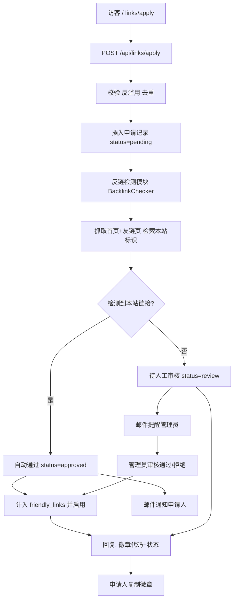

# 友链申请与自动审核交换

Feature Name: friendly-link-exchange
Updated: 2026-09-15

## Description

在现有 `/links` 友情链接页面基础上新增完整"友链交换"闭环：

1. 访客访问独立申请页 `/links/apply`，填写站点名称、URL、简介、邮箱与建议分类提交申请。
2. 后端校验后自动抓取对方站点（首页 + 常见友链页），检测其页面上是否已放置本站链接。
   已放置 → 自动通过并上链；未检出/抓取失败 → 进入人工审核队列，同时邮件提醒管理员。
3. 提交成功即向申请人展示可一键复制的"文字徽章"与"图标徽章" HTML 片段，用于对方挂链。
4. 管理员在 `/admin/links` 新增"申请"标签页查看待审队列，可一键通过 / 拒绝 / 删除。

## Architecture



## Components and Interfaces

### 1. 数据模型 — `friendly_link_applications`（新表，加入 `db.ts` 惰性迁移）

```sql
CREATE TABLE IF NOT EXISTS friendly_link_applications (
  id             VARCHAR(16)  PRIMARY KEY,
  name           TEXT         NOT NULL,
  url            TEXT         NOT NULL,
  description    TEXT,
  category       TEXT,
  email          TEXT         NOT NULL,
  status         TEXT         NOT NULL DEFAULT 'review',  -- review|approved|rejected
  auto_approved  BOOLEAN      NOT NULL DEFAULT false,
  backlink_pages TEXT,                                     -- JSON 抓取摘要 [{url, found}]
  admin_note     TEXT,
  link_id        INTEGER,                                  -- 通过后写入 friendly_links 的 id
  created_at     TIMESTAMPTZ  NOT NULL DEFAULT NOW(),
  reviewed_at    TIMESTAMPTZ
)
```

`friendly_links` 表保持不变；通过审核时 `INSERT INTO friendly_links ... RETURNING id`，
再回写 `link_id`。

### 2. `src/lib/server/site-identity.ts` — 本站标识

- `resolveSiteUrls()` → `{ url, hostname, label }[]`
  - 主 URL：`getSiteUrl()`（`og_url` → `NEXT_PUBLIC_*` → `NEXTAUTH_URL`）
  - 主域名：URL 的 `hostname`
  - 站名：`getSiteLabel()`
- 导出 `matchesSiteIdentity(html, identity)`：`Boolean`

### 3. `src/lib/server/backlink-check.ts` — 反链检测

- `probePaths(hostname)` → 候选路径列表：`["/", "/links", "/friends", "/friend", "/link", "/url", "/links.html"]`
- `fetchPage(path, timeoutMs)` → 安全的 `fetch`（`signal` + `AbortController`，≤ 8s/页，
  `User-Agent` 自定义；仅信任 `http/https`；对返回为非 HTML 的响应跳过）
- `checkBacklink(application)` → `{ found: boolean; pages: Array<{url; found}>; checkedAt: string }`
  - 遍历首页与友链页（总量封顶 4 页，任一命中即短路并标记命中页）
  - 每页用 cheerio 解析 `<a href>` 与文本：
    - `href` 与本站 URL 完全一致、或 hostname 一致（忽略 `www.` 前缀差异、忽略协议差异）
    - 锚文本/页面文本中出现本站站名或本站域名
- 判定：任一页面命中 → `found=true`；全部未命中或全部抓取失败 → `found=false`（保守转人工）

### 4. `src/lib/server/badge.ts` — 徽章生成

- `textBadgeHtml(site)` → 单行 `<a href="本站URL">名称</a>` 风格文字徽章
- `iconBadgeHtml(site)` → 含图标（内联 favicon/svg）+ 站名的徽章 `<a>`，深/浅色两种样式
- 所有插入的用户站名字段经 HTML 转义，`href` 指向 `getSiteUrl()`，`target="_blank" rel`
  安全属性由对方决定（生成纯 `<a>` 片段，不加 target）
- `copyTarget` 统一输出可粘贴的一小段 HTML

### 5. API

- `POST /api/links/apply`
  - 输入：`{ name, url, description, category, email, _hp, _t }`
  - 流程：反滥用（复用 `checkRateLimit` 3 次/分/IP + honeypot + ≥2s 计时）→ 字段校验
    与 URL 白名单 → 同 URL 去重（已通过的同一 hostname 拒绝）→ 写库 → 反链检测 →
    `found=true` 时自动通过写入 `friendly_links` 并回填 `link_id` → 通知（管理员/申请人）→
    返回 `{ status, badge: { textHtml, iconHtml, siteUrl, siteName }, backlink }`
  - 说明：检测在请求内同步完成（≤4 页 × 8s，前端可显示"检测中"），避免队列基础设施
- `GET /api/links/apply/meta` — 返回本站站点名/URL/已有分类，供表单与徽章渲染
- `GET /api/admin/links/applications` — 管理员拉取申请列表（含状态筛选）
- `PUT /api/admin/links/applications` — 通过（写入 `friendly_links` + 回填 + 通知）/ 拒绝（记原因 + 通知）
- `DELETE /api/admin/links/applications` — 删除申请
- `GET /api/links` 保持只返回 `active=true` → 自动/人工通过即公开

### 6. 页面

- `src/pages/links/apply.tsx`
  - 表单区：名称(必填)、URL(必填)、简介、建议分类、邮箱(必填)、蜜罐字段
  - 提交中状态：显示"正在检测对方站点…"
  - 结果视图：
    - 徽章双卡（文字徽章 / 图标徽章），各带"复制 HTML"按钮（`navigator.clipboard`，带失败降级提示）
    - 状态横幅：自动通过（绿色，已上链）/ 待人工审核（琥珀色，说明将在审核通过后上链）
    - 检测摘要：展示各抓取页面是否命中本站链接
- `src/pages/admin/links/applications.tsx`（或在现有 `admin/links.tsx` 加"申请"tab——采用独立页，侧栏已有入口）
  - 列表：站点名/URL/申请人/邮箱/状态/反链摘要/时间，筛选按状态
  - 操作：通过（下拉选择或默认"推荐"分类）、拒绝（填原因）、删除
- `/links` 页 CTA：改为跳转到 `/links/apply`

### 7. 通知（复用 `src/lib/email.ts`）

- 管理员新申请提醒：`sendEmailDirect(ADMIN_EMAIL, "...", linkApplyAdminHtml)`
- 申请人结果（自动通过 / 人工通过 / 拒绝）：`sendEmail(userEmail, "[site] 友链申请结果", ...)`

## Data Models

见上文 `friendly_link_applications` DDL。新增字段场景映射：

| 前端/逻辑字段 | 存储 |
|---|---|
| 站点名称 | `name` |
| 网站地址 | `url` |
| 简介 | `description` |
| 建议分类 | `category` |
| 联系邮箱 | `email` |
| 审核状态 | `status` |
| 是否自动通过 | `auto_approved` |
| 反链检测摘要 | `backlink_pages: JSON [{url, found, reason}]` |
| 管理员备注 | `admin_note` |
| 上链主键 | `link_id` |

## Correctness Properties

- **判定一致**：`matchesSiteIdentity` 对同一页面输入与同一标识集合保持确定性
- **保守失败安全**：任一抓取页无有效响应，枚举该页 `found=false` 且整体不判定为自动通过
- **防重复上链**：同一 hostname 已存在 `approved`/有效 `friendly_links` 时拒绝新申请
- **徽章安全**：用户输入字段整体 HTML 转义；徽章 `href` 仅来自 `getSiteUrl()`
- **仅展示活跃**：公开 `/api/links` 只暴露 `active=true`，审核通过后才可见
- **通知不阻塞主流程**：审核结果邮件发送失败仅记日志，不影响状态写入

## Error Handling

| 场景 | 处理 |
|---|---|
| 站点不可达 / 超时 | `fetchPage` 捕获并记录，该页 `found=false`，整体转人工 |
| cheerio 解析异常 | 该页视为 `found=false` |
| 同 URL 重复申请 | `400 { error: "该站点已申请或已上链" }` |
| 粘帖非法 URL | `400 { error: "URL 格式不正确" }`，仅接受 `http/https` |
| 申请表尚未建表 | 惰性迁移运行时自动创建 |
| 剪贴板不可用（非 HTTPS） | "复制"按钮降级为选中/手动复制提示 |

## Test Strategy

- `backlink-check.test.ts`：同义 URL 匹配（协议差异、`www.` 前缀、路径尾斜杠）、
  站名文本匹配、未命中场景、空响应页面保守处理
- `site-identity.test.ts`：`resolveSiteUrls` 在无配置回退下的行为与 hostname 提取
- `badge.test.ts`：输出包含站名并在 `<a href>` 中转义、href 指向站点 URL
- 集成冒烟（构建 + vitest 基线保持通过）

## References

[^1]: (File) - [src/pages/links.tsx](/workspace/src/pages/links.tsx)
[^2]: (File) - [src/pages/api/links.ts](/workspace/src/pages/api/links.ts)
[^3]: (File) - [src/pages/api/admin/links.ts](/workspace/src/pages/api/admin/links.ts)
[^4]: (File) - [src/lib/db.ts](/workspace/src/lib/db.ts)
[^5]: (File) - [src/lib/server/site-settings-server.ts](/workspace/src/lib/server/site-settings-server.ts)