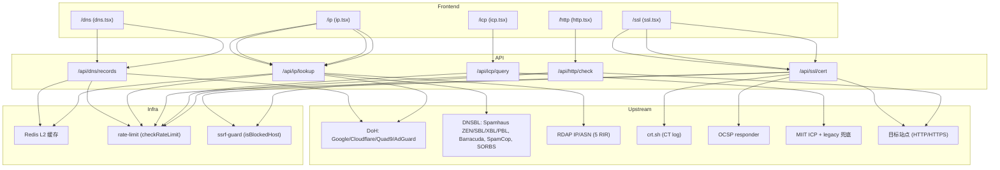

# 查询工具深度增强（DNS / IP / SSL / ICP / HTTP）

Feature Name: query-tools-deepening
Updated: 2026-09-10

## Description

对五个独立查询工具做深度增强，全部沿用既有技术模式（pages/ API + 公开接口 + Redis 缓存 + `checkRateLimit` 限流 + `isBlockedHost` SSRF 防护 + 8 locale i18n）：

1. **DNS Lookup**（`/dns`）：新增 DS/DNSKEY/NSEC/NSEC3/NAPTR/TLSA/SMIMEA 类型；展示各解析器传播一致性；新增 SPF/DMARC 专项解析预设。
2. **IP / ASN**（`/ip`）：新增常见 DNSBL 黑名单信誉检测；新增反向 DNS 多解析器对照。
3. **SSL Cert**（`/ssl`）：新增 crt.sh 证书透明日志（CT）查询；新增 OCSP 吊销状态；新增 TLS 协议版本/密码套件详情。
4. **ICP Filing**（`/icp`）：新增多关键词批量查询；新增标准 6 列 CSV 导出。
5. **HTTP Check**（`/http`）：新增分阶段计时（DNS/TCP/TLS/TTFB）；新增 Cookie 安全属性分析；新增 TLS 握手与证书摘要。

不引入需付费/注册的新第三方服务；不改动 `queryMiitIcp` 接口、单域名结果页、各既有 API 的鉴权与限流语义。

## Architecture



各增强均为「主查询 + 附加上游探测」结构：主查询结果优先返回，附加上游（CT/OCSP/DNSBL/rDNS）失败时降级为局部结果区块，绝不让任一上游故障阻塞主链路。

## Components and Interfaces

### 1. DNS Lookup

**后端 `/api/dns/records.ts`（改造）**

- `RECORD_TYPES` 增加：`DS`(43)、`DNSKEY`(48)、`NSEC`(47)、`NSEC3`(50)、`NAPTR`(35)、`TLSA`(52)、`SMIMEA`(53)，同步补充 `TYPE_NUM` 映射。
- `parseDoHData` 为新增类型补充解析：
  - `DS` → `{ keyTag, algorithm, digestType, digest }`（rdata 空格分隔）
  - `DNSKEY` → `{ flags, protocol, algorithm, publicKey }`
  - `NSEC` → `{ nextDomain, types: string[] }`（rdata 拆分，类型段按 RFC 4034 位图解析，降级为原始字符串）
  - `NSEC3` → `{ algorithm, flags, iterations, salt, nextHashedOwner }`
  - `NAPTR` → `{ order, preference, flags, service, regexp, replacement }`
  - `TLSA`/`SMIMEA` → `{ usage, selector, matchingType, certAssociationData }`
- 响应保持现有形状（`found/records/flat/ttls/resolvers`），`flat` 使用 `normalizeToString` 新增分支。
- **新增响应字段**：
  - `propagation: { consistent: boolean; differing: { resolver: string; missing?: string[] }[] }` —— 对比各解析器 flat 集合计算。
  - `dnssec: { enabled: boolean; hasDs: boolean; hasDnskey: boolean }` —— 仅当本次查询为 DS/DNSKEY 时附带（前端按需额外发起一次 DS+DNSKEY 探测）。
  - `consistent: boolean` 顶层简写。
- 缓存与限流不变（RL 60/60s，`Cache-Control public s-maxage=30`）。

**前端 `/dns`（dns.tsx）**

- 类型选择网格自动新增 7 种类型徽标（复用 `RecordTypeBadge`）。
- 查询响应多出 `propagation` 时：在每个类型结果卡下渲染「传播一致性」小节——一致显示绿标「各解析器一致」，不一致逐解析器列差异。
- 新增「邮件认证」预设按钮：点击后并行查询 `{domain}` TXT 与 `_dmarc.{domain}` TXT，分别解析：
  - SPF：正则提取 `v=spf1` 段，拆分 `ip4/ip6/include/mx/redirect/all` 机制，给出 `-all`/`~all`/无结尾 → 拒绝/软失败/通过 结论。
  - DMARC：解析 `p/sp/rua/ruf/pct/adkim/aspf`，按 `p` 值给强度评级（none=弱 / quarantine=中 / reject=强）。
  - 无记录 → 明确「未配置」文案。
- DNSSEC 状态徽标：每次查询附带一次 DS+DNSKEY 探测（如 R1-AC3），域名同时有两者 → 「DNSSEC 已启用」徽标。

**新增工具函数**：`src/lib/dns-email.ts`（纯函数 `parseSpf`、`parseDmarc`），带单测。

### 2. IP / ASN

**后端 `/api/ip/lookup.ts`（改造）**

- 仅当 `query` 为 IPv4 时执行 DNSBL 检测与 rDNS 对照（IPv6/ASN/主机名跳过或仅对解析后的 IPv4 执行）。
- **DNSBL 检测**（新增 `src/lib/dnsbl.ts`）：
  - 列表：`zen.spamhaus.org`、`sbl.spamhaus.org`、`xbl.spamhaus.org`、`pbl.spamhaus.org`、`b.barracudacentral.org`、`bl.spamcop.net`、`dnsbl.sorbs.net`、`spam.dnsbl.sorbs.net`、`dnsbl.abuse.ch`（开放列表，代码内置常量）。
  - 方法：反转 IPv4（`1.2.3.4` → `4.3.2.1.{zone}`）用 `dns/promises resolve4`，超时 3s，命中 A 记录即被列。
  - 结果形状 `{ zone, listed, returnCode, type, latencyMs }`，`type` 由 returnCode 映射（127.0.0.2 垃圾邮件 / 127.0.0.3 僵尸 / 127.0.0.4 开放代理 / 其他 → 原始码）。
- **rDNS 对照**（新增 `src/lib/rdns.ts`）：
  - 解析器：8.8.8.8、1.1.1.1（`dns.Resolver.setServers` + `resolvePtr`），超时 3s。
  - 结果 `{ resolver, hostname, latencyMs }[]`，不同 hostname 标不一致。
- 响应新增字段：
  - `dnsbl: { tested: number; listed: number; results: DnsblResult[] }`
  - `rdns: { consistent: boolean; records: RdnsResult[] }`
- 缓存：`saveToCache` 保留，DNSBL/rdns 结果随主 payload 一并缓存（`ip:lookup:` TTL 600s）。
- 限流不变（RL 30/60s）。

**前端 `/ip`（ip.tsx）**

- 结果卡新增「信誉检查」小节：列出各 DNSBL 名称、命中状态徽标（红=被列 / 绿=未列 / 灰=不可达）、returnCode、延迟；顶部汇总「x/9 个黑名单命中」。
- 新增「反向 DNS」小节：列出解析器、PTR 域名、延迟；不一致时标黄「解析不一致」。

### 3. SSL Cert

**后端 `/api/ssl/cert.ts`（改造）**

- **CT 日志**（新增 `src/lib/ct-crt-sh.ts`）：
  - `GET https://crt.sh/?q=%25.{domain}&output=json`，超时 8s。
  - 解析 JSON 数组，去重（按 `id`），取前 50 条，字段 `{ name_value, not_before, not_after, id }`。
  - 失败/超时 → `ct: { available: false }`。
  - 仅当 `hostname` 非 IP 时执行。
- **OCSP 吊销**（新增 `src/lib/ocsp.ts`）：
  - 从证书 `raw`（DER）构造 OCSP 请求（`crypto` 的 `X509Certificate` + ASN.1 构造 DER request，或 `node-ocsp` 包——优先自实现 DER 避免新依赖，若实现复杂则回退 `ocsp` npm 包并纳入 `pnpm-workspace.yaml allowBuilds`）。
  - 从证书 issuer（`issuerCertificate` 或 chain 上一级）取 OCSP responder URL（`Authority Information Access`，可通过 `cert.raw` 用 `x509.infoAccess()` 获取）。
  - 超时 4s；结果 `{ status: "good"|"revoked"|"unknown", responder, latencyMs }`；无 responder/失败 → `{ status: "unknown", reason }`。
- **TLS 协议/密码套件**：
  - 使用 `tls.connect` 的 `getProtocol()`（当前已取）与 `getCipher()`（当前已取 name，补充 `standardName` 与 `version`）。
  - 版本探测：对 TLSv1.0/1.1/1.2/1.3 分别建立 `maxVersion` 为对应版本的短连接（`tls.connect({ minVersion, maxVersion })`，握手成功即支持，每个 2s 超时，串行或并发 ≤2）。
  - 输出 `tlsVersions: { "1.0": boolean, "1.1": boolean, "1.2": boolean, "1.3": boolean }` 与 `tlsRating: "secure"|"needs_attention"|"insecure"`（1.0/1.1 支持 → insecure；仅 1.2/1.3 → secure；其余 needs_attention）。
- 响应新增字段：`ct`、`ocsp`、`tlsVersions`、`tlsRating`、`cipher` 扩展。
- 限流与 SSRF 防护不变（RL 20/60s、`isBlockedHost`）。`maxDuration` 20s 维持——CT(8s)+OCSP(4s)+版本探测(并行 4×2s) 与主握手并行执行，用 `Promise.allSettled` 聚合。

**前端 `/ssl`（ssl.tsx）**

- 证书详情下新增三块：
  - 「证书透明日志」：CT 数量徽标 + 前 N 条（名称/签发时间/证书 id），失败显示「CT 不可用」。
  - 「吊销状态」：good 绿标 / revoked 红标警示 / unknown 灰标「OCSP 不可用」。
  - 「TLS 配置」：协议版本徽标行（1.0~1.3 各一，支持绿/不支持灰）、当前握手协议+密码套件、整体评级徽标。
- 沿用 `StatusBadge` 样式体系。

### 4. ICP Filing

**后端 `/api/icp/query.ts`（改造）**

- `search` 参数支持多值：`search=域名1,域名2` 或 `search` 为逗号分隔；新增 `batch=1` 标志时返回聚合结果。
- 批量模式响应：
  ```
  { ok, batch: true, type, results: [{ search, ok, total, pages, list, source, error? }], failed: number, elapsedMs }
  ```
- 批量并发 ≤3，逐个复用现有 `queryMiitIcp`（含 legacy 兜底），每项超时沿用 12s。
- 单条模式保持现有响应形状完全不变（向后兼容）。
- 限流不变（RL 30/60s）。`Cache-Control` 仍 `no-store`（备案数据实时性）。

**前端 `/icp`（icp.tsx）**

- 搜索框支持逗号/换行/空格分隔多词；点击查询后并发分批调用（≤3 并发）。
- 结果区域分组展示每词命中；每词结果可单独重试。
- 「导出 CSV」按钮：UTF-8 BOM，列 = 查询词/单位名称(unitName)/备案号(serviceLicence)/服务名称(serviceName)/更新时间(updateRecordTime)/性质(natureName)。不含负责人与地址。
- 批量完成 toast 汇总「成功 x / 失败 y」。

### 5. HTTP Check

**后端 `/api/http/check.ts`（改造）**

- **分阶段计时**：在现有单 `latencyMs` 基础上拆分：
  - `timing: { dnsMs: number|null, connectMs: number|null, tlsMs: number|null, ttfbMs: number, totalMs: number }`
  - 实现：不使用 `fetch`（无法拆阶段），改用 `http`/`https` 模块 + 手动 `socket`（`lookup`/`connect`/`secureConnect` 事件打点），或使用 `undici` 的 `request` with `onConnect`/timings（若依赖允许）。推荐 **undici**（Next 已内置，`undici.request` 提供 `timings`，包含 `dnsStart/dnsEnd/connectStart/connectEnd/tlsStart/tlsEnd/requestStart/responseStart`）。
  - 保留现有重定向跟随逻辑：每跳记录自己的分阶段计时，最终展示目标跳的计时 + 汇总。
- **Cookie 安全分析**：解析 `set-cookie` 头，每个 cookie 提取 `name/domain/path/expires/secure/httpOnly/sameSite`；缺失项标记风险；输出 `cookies: [{ name, secure, httpOnly, sameSite, issues: string[] }]` 与 `cookieRating: "secure"|"needs_attention"|"insecure"`（任一 cookie 缺 Secure 或 HttpOnly 即需关注，缺 SameSite 标提示）。
- **TLS 摘要**：目标为 HTTPS 时，用 `tls.connect`（短连接）取证书 CN/SAN/valid_to/authorized，输出 `tls: { protocol, cipher, certificate: { cn, sans, validTo, expired, trusted }, } | null`；HTTP 目标返回 `null`。
- 错误分支与既有 `HttpCheckResult` 字段形状保持兼容，新增字段全部可选。
- 限流与 SSRF 防护不变。

**前端 `/http`（http.tsx）**

- 「耗时分析」卡：DNS/TCP/TLS/TTFB/Total 分条显示（ms），TLS 阶段 HTTPS 才有，失败项灰标。
- 「Cookie 分析」卡：逐 cookie 展示属性徽标（Secure/HttpOnly/SameSite 有绿无灰）+ 缺失项红点；无 cookie 显示「无 Cookie」。
- 「TLS / 证书摘要」卡：协议、密码套件、CN、SAN 数、到期日期、过期/不受信任警示。
- 安全头评分卡保持不变。

## Data Models

### DNS 传播视图

```ts
type Propagation = {
  consistent: boolean;
  differing: { resolver: string; missing: string[]; extra: string[] }[];
};
```

### IP DNSBL / rDNS

```ts
type DnsblResult = { zone: string; listed: boolean; returnCode: string | null; type: string | null; latencyMs: number };
type DnsblSummary = { tested: number; listed: number; results: DnsblResult[] };

type RdnsResult = { resolver: string; hostname: string | null; latencyMs: number; error?: string };
type RdnsSummary = { consistent: boolean; records: RdnsResult[] };
```

### SSL CT / OCSP / TLS

```ts
type CtEntry = { nameValue: string; notBefore: string; notAfter: string; id: number };
type CtResult = { available: boolean; count: number; entries: CtEntry[]; error?: string };

type OcspResult = { status: "good" | "revoked" | "unknown"; responder: string | null; latencyMs: number | null; error?: string };

type TlsVersions = { "1.0": boolean; "1.1": boolean; "1.2": boolean; "1.3": boolean };
type TlsRating = "secure" | "needs_attention" | "insecure";
```

### ICP 批量

```ts
type IcpBatchResult = {
  ok: boolean;
  batch: true;
  type: string;
  results: { search: string; ok: boolean; total: number; pages: number; list: IcpRecord[]; source: string; error?: string }[];
  failed: number;
  elapsedMs: number;
};
```

### HTTP 增强

```ts
type HttpTiming = { dnsMs: number | null; connectMs: number | null; tlsMs: number | null; ttfbMs: number; totalMs: number };
type HttpCookie = { name: string; secure: boolean; httpOnly: boolean; sameSite: string | null; issues: string[] };
type HttpCookieAnalysis = { count: number; rating: "secure" | "needs_attention" | "insecure"; cookies: HttpCookie[] };
type HttpTlsSummary = { protocol: string; cipher: string; certificate: { cn: string; sans: string[]; validTo: string; expired: boolean; trusted: boolean } } | null;
```

## Correctness Properties

- **降级优先**：任一附加上游（CT/OCSP/DNSBL/rDNS/TLS 版本探测）失败只影响对应区块，主查询必须返回成功结果。用 `Promise.allSettled` 聚合，绝不用 `all`。
- **不误报**：DNS 无记录 = `found:false` 提示未配置，不得报错；SPF/DMARC 无记录 = 明确「未配置」；OCSP 不可用 ≠ revoked。
- **SSRF 不变式**：所有对用户输入 hostname/IP 发起的连接（HTTP 检查、SSL 握手、TLS 版本探测）继续过 `isBlockedHost`；DNSBL/rDNS 只做 DNS 解析，不建立 TCP。
- **缓存一致性**：IP 缓存仅缓存纯 IP 查询（主机名查询解析结果可能变化，缓存键仍为原 query，TTL 600s 可接受）；CT 缓存键 `ct:cert:{host}` TTL 3600s，OCSP `ocsp:{fingerprint256}` TTL 1800s，DNSBL/rDNS 随 `ip:lookup:` 主键缓存。
- **批上限**：ICP 批量并发 ≤3，单批关键词上限 20；HTTP 版本探测并发 ≤2。
- **限流保持**：五个 API 的 `checkRateLimit` 与 `RL_LIMIT/RL_WINDOW` 不变，批量/增强查询不豁免。

## Error Handling

| 场景 | 处理 |
|------|------|
| crt.sh 超时/不可达 | `ct.available=false` + error，主证书详情正常返回 |
| OCSP responder 缺失/失败 | `ocsp.status="unknown"` + reason，不误报 revoked |
| 证书无 AIA OCSP 扩展 | 跳过，标「无 OCSP 服务器」 |
| DNSBL 某 zone 不可达 | 该 zone 标 `unreachable`，汇总 `tested` 相应减少 |
| rDNS 解析器超时 | 该解析器标 error，`consistent` 基于可用子集 |
| TLS 版本探测某版本失败 | 该版本 false，不做猜测 |
| ICP 批量部分词失败 | 逐词 error 字段，`failed` 计数，前端允许单条重试 |
| HTTP 分阶段某阶段失败 | 该阶段 null 并标注，其余阶段照常 |

## Test Strategy

- **新增单测（vitest，纯函数优先）**：
  - `src/lib/dns-email.test.ts`：SPF 解析（v=spf1 含 ip4/include/-all/~all）、DMARC 解析（p/sp/rua/pct）、无记录。
  - `src/lib/dnsbl.test.ts`：反转 IP 逻辑、returnCode → type 映射。
  - `src/lib/rdns.test.ts`：PTR 解析器对照的一致性判定。
  - `src/lib/ct-crt.sh.test.ts`：JSON 解析去重、超时降级（mock fetch）。
  - `src/lib/ocsp.test.ts`（若自实现 DER）：请求构造与状态解析（mock responder）。
  - `src/lib/http-timing.test.ts`：undici timings → `HttpTiming` 映射、null 边界。
  - `src/lib/icp-batch.test.ts`：批量拆分、结果聚合、失败计数。
- **回归验证链**：`npx tsc --noEmit` → `npx vitest run`（全量，含既有测试）→ dev server 冒烟：
  - DNS：查 `google.com` DS/DNSKEY（DNSSEC 徽标）、`cloudflare.com` SPF/DMARC、任意域传播一致性。
  - IP：`8.8.8.8` DNSBL+rDNS、`1.1.1.1` rDNS 对照。
  - SSL：`google.com` CT 列表 + OCSP good；构造过期证书用例验 revoked 展示（可用 `expired.badssl.com`）。
  - ICP：多词批量 + CSV 导出列校验。
  - HTTP：`https://google.com` 分阶段计时 + Cookie + TLS 摘要；`http://example.com` 非 HTTPS 分支。
- **8 locale 校验**：`check-locale-keys.mjs` 或 parity 脚本确认新增键在 en/zh/zh-tw/ja/ko/... 全部同步。

## References

^1: (src/pages/api/dns/records.ts) — 现有 DNS 记录解析与 DoH 合并逻辑
^2: (src/pages/api/ip/lookup.ts) — 现有 IP/ASN 地理 + RDAP 聚合
^3: (src/pages/api/ssl/cert.ts) — 现有 TLS 握手与证书解析
^4: (src/pages/api/icp/query.ts) — 现有 ICP 查询与 legacy 兜底
^5: (src/pages/api/http/check.ts) — 现有 HTTP 状态/重定向/安全头检查
^6: (src/lib/server/icp-miit.ts#L136) — `queryMiitIcp` 接口签名（保持不变）
