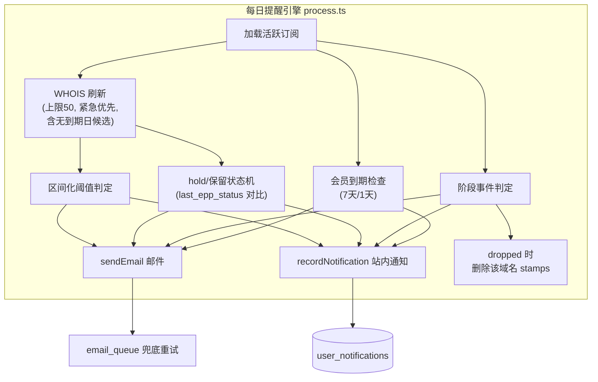
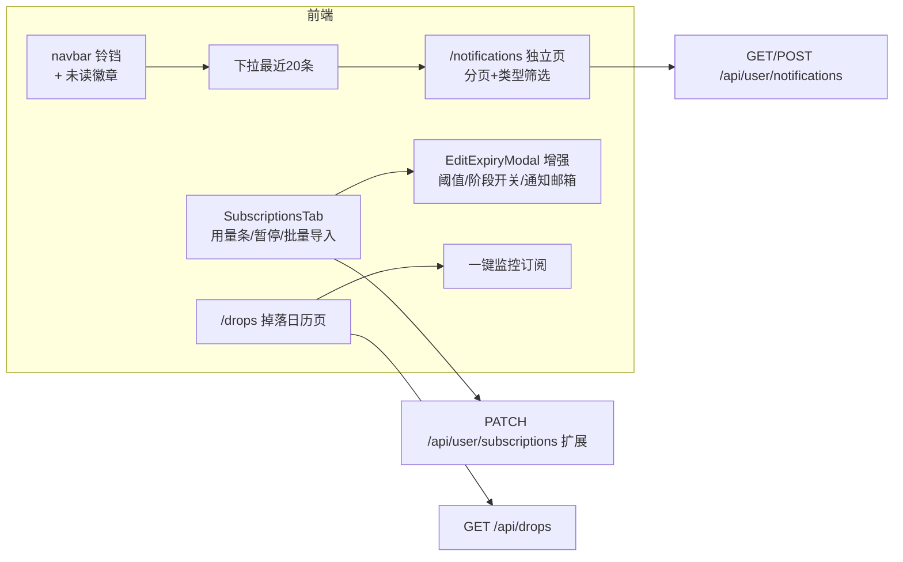

# 用户中心订阅增强 — 技术设计

Feature Name: user-center-subscription-enhancement
Updated: 2026-09-05

## Description

在现有用户中心（/dashboard 四 Tab 架构）与提醒引擎（每日 cron process.ts）之上，分四批实施 14 项需求：缺陷修复（R1-R4）、订阅管理增强（R5-R8）、通知增强（R9-R12）、掉落日历（R13-R14）。设计原则：最小侵入既有表结构（增量字段）、提醒引擎单点扩展（所有新通知类型收敛到 process.ts 单次扫描）、前端复用 dashboard 组件体系。

## Architecture





## Components and Interfaces

### 1. 数据访问层（src/lib/db.ts）

新增 ALTER TABLE（追加到既有迁移数组）：

```sql
ALTER TABLE reminders ADD COLUMN IF NOT EXISTS notify_email TEXT;
ALTER TABLE reminders ADD COLUMN IF NOT EXISTS paused BOOLEAN NOT NULL DEFAULT false;
ALTER TABLE reminders ADD COLUMN IF NOT EXISTS last_epp_status TEXT;
ALTER TABLE reminders ADD COLUMN IF NOT EXISTS hold_notified_at TIMESTAMPTZ;
ALTER TABLE reminders ADD COLUMN IF NOT EXISTS reserved_notified_at TIMESTAMPTZ;
ALTER TABLE users ADD COLUMN IF NOT EXISTS membership_remind_stage TEXT;
```

新增表：

```sql
CREATE TABLE IF NOT EXISTS user_notifications (
  id         VARCHAR(20) PRIMARY KEY,
  email      TEXT NOT NULL,
  type       TEXT NOT NULL,        -- reminder | hold | reserved | membership | system
  title      TEXT NOT NULL,
  body       TEXT,
  domain     TEXT,
  read_at    TIMESTAMPTZ,
  created_at TIMESTAMPTZ NOT NULL DEFAULT NOW()
);
CREATE INDEX IF NOT EXISTS idx_user_notifications_email ON user_notifications (email, created_at DESC);
CREATE INDEX IF NOT EXISTS idx_user_notifications_unread ON user_notifications (email) WHERE read_at IS NULL;
```

站点设置新键：`drop_calendar_public`（'true' 默认，admin/settings 可切换）。

### 2. 提醒引擎（src/pages/api/remind/process.ts）

- **R3 区间化阈值**：`thresholds` 先降序排序；档位 t_i 触发条件为 `daysToExpiry <= t_i && daysToExpiry > t_{i+1}`（末档下界 0）。同步修改 `api/user/subscriptions.ts` GET 与 `api/user/dashboard.ts` 的 next_reminder_at 计算，保证 UI 与引擎语义一致。
- **R4 WHOIS 扩容**：`WHOIS_SYNC_LIMIT` 20→50；候选排序按剩余天数升序（无到期日的候选排最后、纳入刷新）；临期未刷到的自然顺延次日。
- **R9 hold/保留状态机**：每次 WHOIS 刷新后持久化 `last_epp_status`（JSON 数组）。判定：
  - 新状态含 hold 且 `hold_notified_at IS NULL` → 发通知邮件 + 置 `hold_notified_at=NOW()`
  - 新状态不含 hold 且 `hold_notified_at IS NOT NULL` → 发解除邮件 + 置 NULL
  - 保留状态（serverProhibited/reserved 类）同理用 `reserved_notified_at`
  - 未刷新到 WHOIS 的订阅跳过检测（hold 场景集中于临期，与 90 天同步窗口吻合）
- **R11 会员到期**：新增独立查询 `users WHERE subscription_access=true AND subscription_expires_at` 在未来 7/1 天窗口 → 按 `membership_remind_stage`（NULL→'7d'→'1d'）去重发送；支付成功回调（payment.ts:144-165 三处 UPDATE）将 stage 重置 NULL。
- **R1.6 掉落删 stamps**：dropped 分支追加 `DELETE FROM stamps WHERE domain = $1`。
- **R6 暂停跳过**：加载订阅时 `WHERE active = true AND paused = false`（GET 列表接口不过滤 paused）。
- **R10 站内通知**：新增 `src/lib/notify.ts` 导出 `recordNotification({email, type, title, body, domain})`，各发送点在调用 sendEmail 的同一位置调用，catch 吞错（通知失败不阻断邮件流程）。

### 3. 账户生命周期（R1/R2）

- **delete-account.ts**：改为单条 data-modifying CTE 语句原子完成（users 删除 + reminders 软取消 + email_queue 按 to_email 删除 + stamps 删除），失败自然整体回滚；返回 `{ok, cleaned: {reminders, emails, stamps}}` 统计。
- **profile.ts PATCH**：email 变更 UPDATE 成功后（profile.ts:89），追加单条 CTE 迁移 `reminders.email`、`stamps.email` 旧→新（保留 notify_email 已设值）；迁移失败则回滚 users.email 更新（恢复语句）并返回错误。

### 4. 订阅 API（src/pages/api/user/subscriptions.ts）

PATCH 扩展字段：
- `thresholds: number[]`（1-365 任意天数，去重降序，最多 5 档）→ 写 `thresholds_json`
- `phase_flags: {grace?, redemption?, pendingDelete?, dropSoon?, dropped?}` → 写 `phase_flags`
- `notify_email: string | null`（校验格式，null 表清除）→ 写 `notify_email`
- `paused: boolean` → 写 `paused`

GET 响应增加 `notify_email`、`paused` 字段（可空，前端兼容）。

新增端点：
- `POST /api/user/subscriptions/bulk`：body `{domains: string[]}`（≤50），复用 submit.ts 的域名校验；逐条判断已订阅（含 inactive 重激活）与免费配额（复用 submit.ts:115-147 逻辑）；创建时 `expiration_date=NULL` 落库；返回 `{created, skippedDuplicate, skippedQuota, invalid}`。限流 3 次/小时。
- `GET /api/user/subscriptions.ics`：遍历活跃订阅，每条生成 VEVENT（到期日 + 预计掉落日，SUMMARY 含域名），`Content-Disposition: attachment; filename="whois-subscriptions.ics"`。纯函数 `buildIcs(subs)` 放 `src/lib/ics.ts` 便于单测。

### 5. 通知 API（新增 src/pages/api/user/notifications.ts）

- `GET ?badge=1` → `{unread}`（navbar 轮询/进入页面时取）
- `GET ?limit=20&offset=0&type=reminder|hold|reserved|membership|system` → `{notifications, total}`
- `POST {action:'read', ids?: string[]}` → 无 ids 标记全部已读
- 仅登录用户可访问，按 session.email 过滤

### 6. 掉落日历（新增 src/pages/api/drops.ts + src/pages/drops.tsx）

- API `GET /api/drops?days=30`：
  - 公开部分：`expired_domain_leads WHERE status='available' AND available_date >= today ORDER BY available_date LIMIT 500`（available_date 为 TEXT YYYY-MM-DD，字符串比较有效）
  - 私有部分（有 session）：活跃订阅中 `phase IN ('pendingDelete')` 或 `days_to_drop <= 30` 的域名，按 `drop_date` 分组
  - `drop_calendar_public=false` 且无 session → 仅返回私有部分为空 + `public_locked: true` 标记，前端显示登录引导
- 页面 `/drops`：按日期分组卡片（复用 glass-panel 风格），每域名行含"监控"按钮（登录态）→ 调 `/api/remind/submit` 复用现有订阅创建；未登录按钮跳登录。

### 7. 前端组件

| 文件 | 变更 |
|------|------|
| `src/components/navbar.tsx` | 登录态增加铃铛图标 + 未读徽章 + 下拉（最近 20 条，"查看全部"→ /notifications） |
| `src/components/dashboard/SubscriptionsTab.tsx` | 免费用量条（x/5 + 满 5 显示升级引导）；暂停/恢复按钮（与取消区分）；批量导入入口按钮 + 模态框（textarea 粘贴清单，展示结果统计）；导出菜单加"导出日历(.ics)" |
| `src/components/dashboard/EditExpiryModal.tsx` | 增加阈值多选（60/30/10/5/1 + 自定义天数输入）、阶段开关 5 项、通知邮箱输入（默认账户邮箱占位）；保存调用扩展后的 PATCH |
| `src/components/dashboard/MembershipTab.tsx` | 到期前 7 天/已过期横幅（含购买按钮）；"购买即叠加时长"说明文案 |
| `src/pages/notifications.tsx` | 新页面：分页列表 + 类型筛选 chips + 全部已读 |
| `src/pages/drops.tsx` | 新页面：掉落日历 |
| `src/hooks/useDashboard.ts` | 增加暂停/恢复/批量导入/通知相关 actions |

### 8. 邮件模板（src/lib/email.ts + email-strings.ts）

新增 4 个模板（zh/en 双语，复用既有邮件骨架）：
- `holdNotifyHtml` / `holdReleasedHtml`（hold 进入/解除）
- `reservedNotifyHtml`（保留状态进入；解除复用 holdReleased 文案结构）
- `membershipRenewHtml`（会员到期，含续费按钮指向 /payment/checkout）

### 9. i18n

- UI 键新增约 70 keys × 8 locales（zh/zh-tw/en/ja/ko/de/fr/ru，缺译先用英文回填 zh-tw 繁化、其余英文）
- 邮件文案键仅 zh/en（email-strings.ts 既有模式）

## Data Models

关键语义分离：`reminders.email` 仅作归属键（登录查询、删除账户、改邮箱迁移均按此），实际投递地址 = `notify_email ?? email`。process.ts 所有 sendEmail 调用点改用该表达式取收件人。

## Correctness Properties

1. 阈值区间互斥：任意 daysToExpiry 值至多命中一个档位区间；档位边界值（恰剩 30 天）命中 30 档而非 60 档。
2. hold 通知幂等：`hold_notified_at` 非空期间不重复发送；解除后再次进入可再发。
3. 账户删除原子性：CTE 单语句保证 users/reminders/email_queue/stamps 四表变更同生共死。
4. 站内通知只增不改：通知记录创建后仅 `read_at` 可变更。
5. 免费配额不变式：批量导入后活跃订阅数对免费用户 ≤ 5（逐条预检）。
6. 既有订阅兼容：`thresholds_json`/`phase_flags` 为 NULL 的旧记录沿用默认值；`notify_email`/`paused` NULL 语义 = 投递到归属邮箱 / 未暂停。

## Error Handling

- WHOIS 刷新失败：现有 warn 日志 + 次日重试（不变）
- recordNotification 失败：吞错记日志，不影响邮件主流程
- 批量导入单条失败：计入 invalid 统计继续处理其余
- CTE 迁移失败（改邮箱）：恢复 users.email 原值，返回 500 提示重试
- ics 生成异常：返回 500；前端 toast 提示
- 掉落日历 API 失败：页面展示错误态 + 重试按钮（复用 dashError 模式）

## Test Strategy

- 单测（vitest，现有 utils.test.ts 模式）：
  - `src/lib/ics.ts` buildIcs 输出格式（VEVENT 数、日期格式、转义）
  - 阈值区间判定纯函数（边界值 30/10/5/1、晚订阅场景、自定义档位）
  - hold 状态机转移表（无→hold→hold→解除→hold）
- 每批验证链（沿用项目惯例）：`npx tsc --noEmit` → dev curl → `pnpm build` + `next start` 生产验证 → push → Vercel 轮询 → 线上 curl（--resolve）
- 批 1 上线后观察一个 cron 周期（09:00 UTC）的 Sentry 无新 issue 再进批 2

## Implementation Batches

| 批次 | 内容 | 预估 |
|------|------|------|
| 1 | R1-R4 缺陷修复（纯后端 + process.ts） | 半天 |
| 2 | R5-R8 订阅管理（编辑弹窗/暂停/导入/用量条） | 1 天 |
| 3 | R9-R12 通知（hold/通知中心/会员/ics） | 1 天 |
| 4 | R13-R14 掉落日历 | 半天-1 天 |

每批独立 commit + 部署 + 线上验证；PWA 构建产物（public/sw.js、workbox-*）提交前 `git checkout` 还原。

## References

[^1]: (src/lib/db.ts#L60-L79) reminders / reminder_logs 表结构
[^2]: (src/pages/api/remind/process.ts#L375-L404) 既有阈值触发逻辑（区间化改造点）
[^3]: (src/pages/api/user/delete-account.ts#L42) 账户删除单语句（CTE 改造点）
[^4]: (src/pages/api/user/profile.ts#L89-L101) 改邮箱 UPDATE 成功点（迁移插入点）
[^5]: (src/pages/api/remind/submit.ts#L115-L147) 免费配额校验（bulk 复用）
[^6]: (src/lib/lifecycle.ts#L968-L981) getPhaseFromEppStatus（hold 映射缺失处）
[^7]: (src/lib/db.ts#L495-L518) expired_domain_leads 表（掉落日历数据源）
[^8]: (src/lib/payment.ts#L144-L165) 支付成功 UPDATE（membership_remind_stage 重置点）
