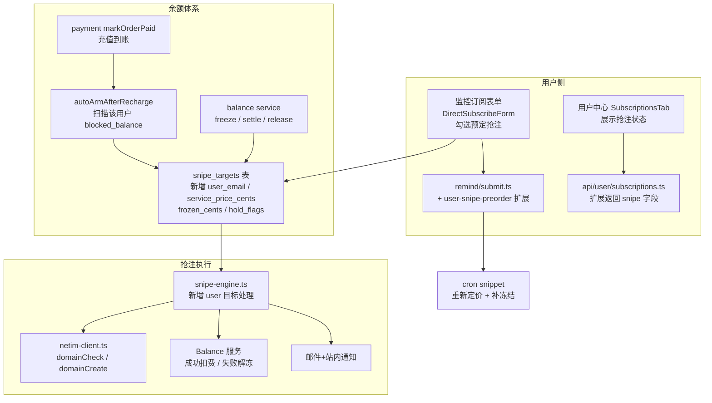

# User Domain Preorder Sniping — 技术设计

Feature Name: user-snipe-preorder
Updated: 2026-09-12

## Description

向普通用户开放过期域名预定抢注：监控订阅表单扩展「预定抢注」选项；用户勾选后系统按 Netim `queryDomainPrice`（EUR）经固定汇率换算 CNY 计算服务价（=4×预估注册价），以 `hold` 模式冻结服务价作为门槛；冻结成功目标进入竞速（复用 `snipe-engine`），抢注成功扣费、失败解冻。同域名先到先得占坑。域名注册在平台 Netim 账户，后续交付另行走单。

依赖既有能力（已实现）：`snipe-engine.ts`（状态机/claim/审计/邮件）、`reminders` 订阅提交与用户中心列表、`users.balance_cents` + `balance_transactions`、支付充值到账回调 `markOrderPaid`。

## Architecture



关键变化点：
1. `snipe_targets` 增加用户归属与资金列；管理员目标（无 user_email）走原有流程不冻结。
2. `snipe-engine` 的注册执行前加入"冻结完成校验"；成功/失败收尾接入余额 settle/release。
3. 竞速窗口探测仍由 existing `snipe-hunt.yml` + `snipe-probe.ts` 承接，仅需把用户目标纳入查询并保持其 `armed` 条件与冻结一致。

## Components and Interfaces

### 1. 数据表变更（`src/lib/db.ts` MIGRATIONS 扩展）

```sql
ALTER TABLE snipe_targets ADD COLUMN IF NOT EXISTS user_email       TEXT;
ALTER TABLE snipe_targets ADD COLUMN IF NOT EXISTS service_price_cents BIGINT;
ALTER TABLE snipe_targets ADD COLUMN IF NOT EXISTS frozen_cents     BIGINT NOT NULL DEFAULT 0;
ALTER TABLE snipe_targets ADD COLUMN IF NOT EXISTS hold_keys        TEXT;  -- JSON: 单目标冻结流水的最小 key
CREATE INDEX IF NOT EXISTS idx_snipe_targets_user ON snipe_targets (user_email) WHERE user_email IS NOT NULL;
CREATE UNIQUE INDEX IF NOT EXISTS uq_snipe_targets_user_hold ON snipe_targets (id) WHERE user_email IS NOT NULL AND status IN ('armed','blocked_balance','sniping');
```

- `user_email` 为空 = 管理员级目标（不冻结、不扣费）。
- 占坑唯一性由 `uq_snipe_targets_user_hold`（单索引对同域名 `domain UNIQUE` 已保证：一张表一个域名一行，天然先到先得）。
- `balance_transactions.type` 新增枚举：`hold`（冻结）、`unhold`（解冻）、`snipe`（成功扣费）。

### 2. 定价服务（新增 `src/lib/server/snipe-pricing.ts`）

```ts
export const SNIPE_MARKUP = 4;                      // 服务价 = 4 × 预估注册价
export async function snipeServicePrice(domain: string): Promise<{
  eurCost: number | null;      // queryDomainPrice 注册价 EUR
  cnyCost: number | null;      // round(eurCost * FX)
  serviceCents: number | null; // round(cnyCost * SNIPE_MARKUP * 100)
  fxRate: number;              // 本次使用的汇率
  error?: string;
} | null>;
```

- 汇率来源：`site_settings` 键 `snipe_eur_fx_rate`（缺省 8.0），后台可配。
- 每次换价/补冻结时重算；服务价终身可随注册价上涨上调（下调不回退）。

### 3. 余额冻结/扣费（新增 `src/lib/server/snipe-balance.ts`）

```ts
export async function freezeForSnipe(targetId, userEmail, amountCents): Promise<"ok"|"insufficient"|"noop">;
export async function settleSnipeCharge(targetId, userEmail, amountCents): Promise<void>;  // hold→snipe
export async function releaseSnipeHold(targetId, userEmail, amountCents): Promise<void>;   // hold→unhold
export async function settleBalanceAndWrap(targetId, newServiceCents): Promise<void>;      // 服务价上调补冻结
```

- `freeze`：`UPDATE users SET balance_cents = balance_cents - $2, frozen_cents = frozen_cents + $2 WHERE id=$1 AND balance_cents >= $2`，成功写 `type='hold'` 流水（description 记目标域名）。
- `settle`：`frozen_cents -= amount; balance_cents -= 0`（已冻结扣走）；写 `type='snipe'` 流水。
- `release`：`frozen_cents -= amount; balance_cents += amount`；写 `type='unhold'` 流水。
- 幂等：`hold_keys` 存流水 min key；存在则跳过。

### 4. 提交扩展（`src/pages/api/remind/submit.ts`）

- `POST` payload 增 `snipe: boolean`。
- `snipe=true` 时：核算服务价 → 同事务内写 `snipe_targets`（user_email、service_price_cents）+ `freeze` 尝试：
  - 冻结成功 → 目标 `armed`；响应含 `snipe: {status:'armed', serviceCents}`。
  - 冻结失败 → 目标 `blocked_balance`；响应含 `snipe: {status:'blocked_balance', serviceCents, balanceCents}`。
- 域名已占用（表已有非 failed/cancelled 行）→ `409 SNIPE_TAKEN`。
- 取消订阅时同步取消目标（软删 `cancelled`）。

### 5. 用户中心（`api/user/subscriptions.ts` 扩展 + `SubscriptionsTab.tsx`）

- GET 每项并入：`snipe_status`（none/blocked_balance/armed/sniping/succeeded/failed/cancelled）、`service_cents`、`frozen_cents`、`snipe_fail_reason`。
- 展示：抢注状态徽章、服务价与余额进度条（不足则「去充值」按钮跳 `/payment/checkout`）。
- PATCH 支持 `snipe_action: 'enable'|'disable'`：enable 走定价+冻结复用 submit 逻辑；disable 释放占坑（失败/取消目标允许再占）。

### 6. 充值到账自动武装（`src/lib/payment.ts` markOrderPaid 收尾扩展 / 新增 hook）

- `markOrderPaid` 到账后调用 `autoArmBlockedTargets(userEmail)`：查该用户所有 `blocked_balance` 目标，依次 `freezeForSnipe`，成功者转 `armed` 并发通知（站内 + 邮件）。

### 7. 抢注引擎调用余额接缝（`src/lib/server/snipe-engine.ts`）

- `probeTarget` 注册前（`sniping` CAS 后）：`user_email` 存在则要求 `frozen_cents >= service_price_cents`，否则跳过注册记 `blocked_balance`（防御，正常不会触发）。
- `settleCreate` 成功分支尾部：`user_email` 存在 → `settleSnipeCharge(...)` + 成功通知（扣费金额）。
- 确定性失败分支尾部：`releaseSnipeHold(...)` + 解冻通知。
- 滞留/失败（failed_transient、unknown_pending）沿用现有行为，仅确定失败执行解冻。

### 8. 邮件/站内（`src/lib/email.ts` + `notifications.ts`）

- 新增中文固定文案模板：`snipeArmedHtml`（已冻结进入竞速）、`snipeSettledHtml`（成功扣费金额+操作号）、`snipeReleasedHtml`（未抢到解冻金额）、`snipeInsufficientHtml`（需充值金额缺口）。
- `balance_transactions` 前端流水展示（MembershipTab）补充新 type 中文标签。

### 9. Cron 补定价（`src/pages/api/cron/snipe-probe.ts` daily 段扩展）

- daily 模式：对 `user_email IS NOT NULL` 且未 `succeeded/failed/cancelled` 的目标重算服务价；上调则 `settleBalanceAndWrap` 补冻结，余额不足回 `blocked_balance`。

## Data Models

```sql
-- bump balance_transactions.type: hold | unhold | snipe
ALTER TABLE balance_transactions ADD COLUMN IF NOT EXISTS target_id TEXT;  -- 关联 snipe_targets.id，审计可追溯

-- site_settings 键
--   snipe_eur_fx_rate = 8.0
--   snipe_markup      = 4
```

## Correctness Properties

1. **先到先得占坑**：`snipe_targets.domain UNIQUE` 单表约束，任何时刻同一域名仅一行有效目标。
2. **冻结才算门槛**：`armed` 前置条件 = `frozen_cents == service_price_cents`；注册执行前复核，否则跳过。
3. **资金幂等**：`hold_keys` 防止重复冻结/解冻；`type='snipe'` 流水存在则不再扣费。
4. **失败不扣费**：仅 `succeeded` 触发 settle；确定性失败/取消释放。
5. **凭证与金额安全**：服务价与冻结金额总是服务端重算，客户端不可篡改。

## Error Handling

| 场景 | 处理 |
|---|---|
| 冻结时余额不足 | 目标 `blocked_balance`；通知缺口金额；充值到账自动重试 |
| 域名已被占坑 | 409 `SNIPE_TAKEN`，提示已被其他用户预定 |
| 注册价上调导致补冻结不足 | 目标回 `blocked_balance`，通知差额 |
| 扣费瞬间目标流水冲突 | `hold_keys` 幂等，重试/忽略重复 |
| 注册成功但余额异常 | 目标仍 `succeeded`，平台先行垫付成本，邮件提示后续处理 |
| queryDomainPrice 失败 | 使用上次服务价；无上次则保持 blocking 并重试 |

## Test Strategy

1. **单元**：`snipe-balance` 冻结/结算/解冻 SQL 与幂等（内存 fake db）；定价换算（EUR→CNY×4）。
2. **状态机**：`snipe-engine` 增补用户目标分支（注册前冻结校验、成功扣费、失败解冻）。
3. **API**：`remind/submit` 增加 `snipe=true` 冻结成功/不足/占坑三态；充值到账自动武装。
4. **回归**：现有 snipe-engine + netim-client 测试保持全绿；`check:i18n` 不受影响（中文固定文案）。

## References

[^1]: (Filename#L569-L618) - `src/lib/db.ts` snipe_targets/snipe_probes/snipe_attempts 迁移
[^2]: (Filename#L168-L224) - `src/lib/server/snipe-engine.ts` 状态机与 claim
[^3]: (Filename#L92-L293) - `src/lib/payment.ts` markOrderPaid 到账与 balance_transactions
[^4]: (Filename#L60-L79) - `src/lib/db.ts` reminders 表（订阅）
[^5]: (Filename#L695-L1206) - `src/pages/remind/index.tsx` 订阅列表与 DirectSubscribeForm
[^6]: (Filename#L337-L387) - `src/pages/api/user/subscriptions.ts` GET/PATCH 用户订阅